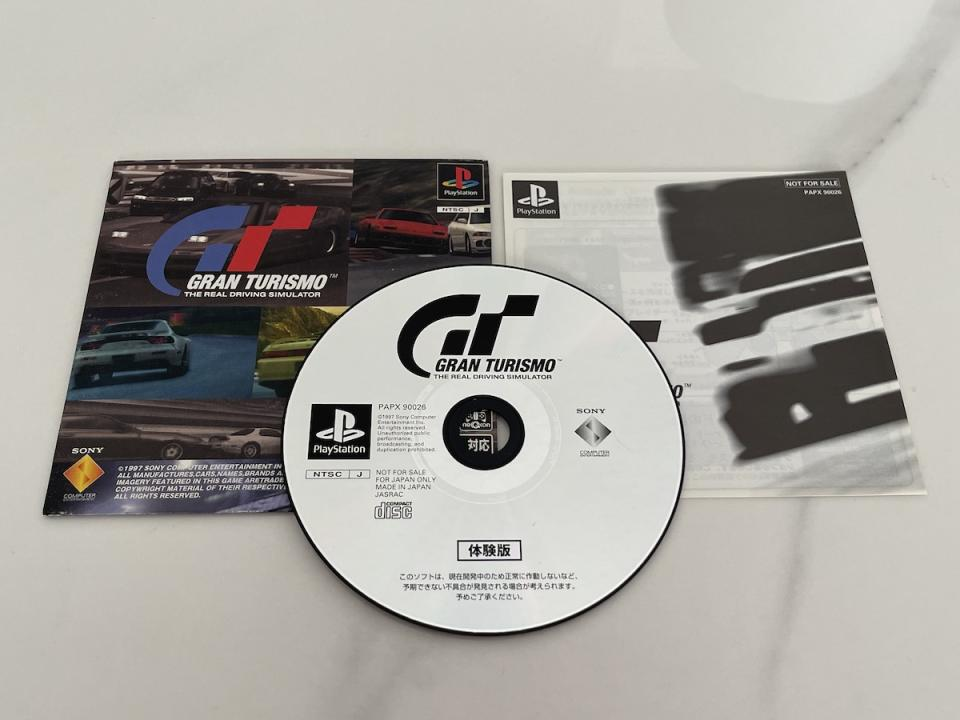

## GRAN TURISMO NTSC DEMO (Jul 29, 1997)

{ width="250"}

:material-shovel: *Dumped*: {++Yes++} - available on [Hidden Palace](https://hiddenpalace.org/Gran_Turismo_(Jul_29,_1997_prototype))

---

## Gran Turismo Test Drive Disc (Aug. 2, 1997)

{ width="250"}
{ width="250"}

:material-shovel: *Dumped*: {++Yes++} - available on [Hidden Palace](https://hiddenpalace.org/Gran_Turismo_(Aug_2,_1997_prototype)) · :material-disc: [Redump Info](http://redump.org/disc/34159/)

Game Code: `PCPX-96085`

??? youtube "Video by [Paiky/GT Archive](https://www.youtube.com/@GTArchivePaiky)"
    <iframe width="935" height="721" src="https://www.youtube.com/embed/gZnCtS0LnpM" title="Gran Turismo Test Drive Disc | PCPX-96088 | Aug 2, 1997" frameborder="0" allow="accelerometer; autoplay; clipboard-write; encrypted-media; gyroscope; picture-in-picture; web-share" allowfullscreen></iframe>

---

## Gran Turismo - Preview Build V1 (Sep ??, 1997)

:material-shovel: *Dumped*: :x: {==No==}

??? youtube "Video"
    <iframe width="1280" height="720" src="https://www.youtube.com/embed/8-ALZvDXUzY" title="Gran Turismo Preview V1 - A first look at GT Mode" frameborder="0" allow="accelerometer; autoplay; clipboard-write; encrypted-media; gyroscope; picture-in-picture; web-share" allowfullscreen></iframe>

---

## Gran Turismo Trial Version Disc (Oct 27, 1997)

{ width="250"}

:material-shovel: *Dumped*: {++Yes++} - available on [Hidden Palace](https://hiddenpalace.org/Gran_Turismo_(Oct_27,_1997_prototype)) · :material-disc: [Redump Info](http://redump.org/disc/7772/)

Game Code: `PAPX-90026`

??? youtube "Video by [Paiky/GT Archive](https://www.youtube.com/@GTArchivePaiky)"
    <iframe width="931" height="721" src="https://www.youtube.com/embed/bfXGh_ZZJ2I" title="Gran Turismo Trial Version Disc | PAPX-90026 | Oct 27, 1997" frameborder="0" allow="accelerometer; autoplay; clipboard-write; encrypted-media; gyroscope; picture-in-picture; web-share" allowfullscreen></iframe>

---

## Gran Turismo Store Demo (Nov. 3, 1997)

{ width="250"}

:material-shovel: *Dumped*: {++Yes++} - available on [archive](https://archive.org/details/Gran-Turismo-Store-Demo-PCPX-96096) · :material-disc: [Redump Info](http://redump.org/disc/75592/)

Game Code: `PCPX-96096`

??? youtube "Video"
    <iframe width="853" height="480" src="https://www.youtube.com/embed/D6YsZJALtYs" title="Gran Turismo Store Demo PCPX-96096 Gameplay" frameborder="0" allow="accelerometer; autoplay; clipboard-write; encrypted-media; gyroscope; picture-in-picture; web-share" allowfullscreen></iframe>

---

## GRAN TURISMO ACCESS ALL MODES V2 Preview Version NTSC (Nov. 13, 1997)

:material-shovel: *Dumped*: {++Yes++} - available on [Hidden Palace](https://hiddenpalace.org/Gran_Turismo_(Nov_13,_1997_prototype)) · :material-disc: [Redump Info](http://redump.org/disc/7772/)

??? youtube "Video"
    <iframe width="1180" height="664" src="https://www.youtube.com/embed/muxe-N_mPn4" title="Gran Turismo Beta Build: Reactions / First Impressions" frameborder="0" allow="accelerometer; autoplay; clipboard-write; encrypted-media; gyroscope; picture-in-picture; web-share" allowfullscreen></iframe>

---

## Gran Turismo US Demo Disc (Mar 3, 1998)

{ width="250"}

:material-shovel: *Dumped*: {++Yes++} - available on [archive](https://ia801802.us.archive.org/view_archive.php?archive=/14/items/redump.psx.p2/Gran%20Turismo%20%28USA%29%20%28Demo%29.zip) · :material-disc: [Redump Info](http://redump.org/disc/12307/)

Game Code: `SCUS-94257`

## Gran Turismo

{ width="250" }
{ width="324" }
{ width="250" }

:material-shovel: *Dumped*: {++Yes++}

The main build of Gran Turismo 1.

* JP Game Code: `SCPS-10045`
* US Game Code: `SCUS-94194`
* EU Game Code: `SCES-00984`
