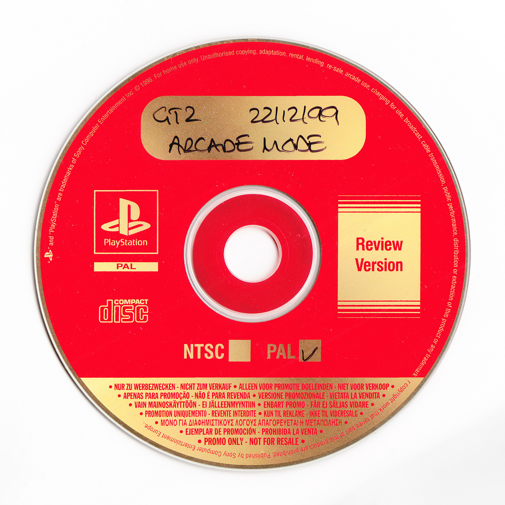
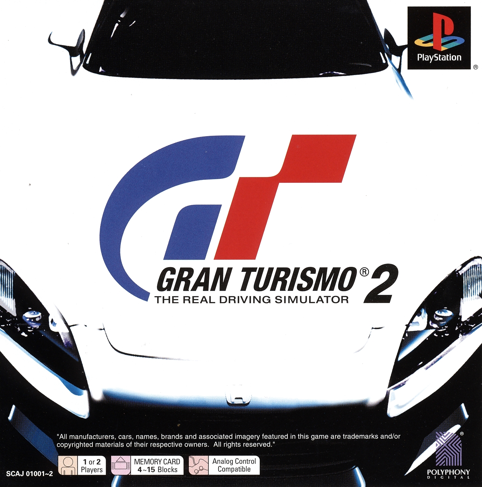
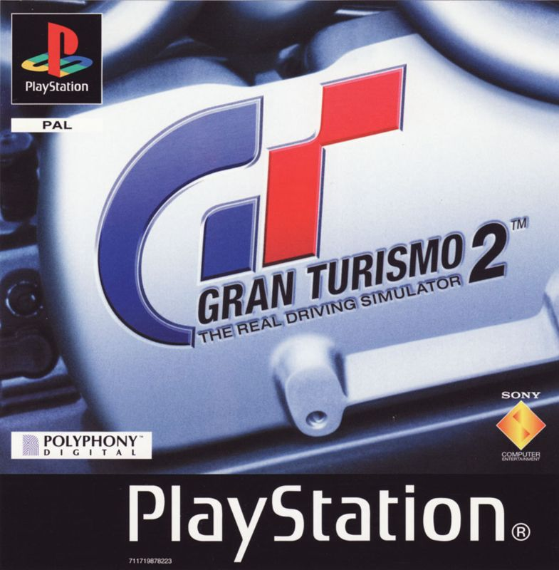

Note that a lot of Playstation demos share the same GT2 contents.

## GT2 "The Making of Gran Turismo 2" Build  (??? ??, 199?)

:material-shovel: *Dumped*: :x: {==No==}

??? youtube "Video"
    <iframe width="1180" height="664" src="https://www.youtube.com/embed/L6bzur_ZqyA" title="Gran Turismo 2 - More Beta Footage" frameborder="0" allow="accelerometer; autoplay; clipboard-write; encrypted-media; gyroscope; picture-in-picture; web-share" allowfullscreen></iframe>

---

## GT2 E3 Build 1999  (~May ??, 1999)

:material-shovel: *Dumped*: :x: {==No==}

??? youtube "Video"
    <iframe width="1180" height="664" src="https://www.youtube.com/embed/cJgpI2MWhgc" title="Gran Turismo 2 Beta Footage From E3 1999" frameborder="0" allow="accelerometer; autoplay; clipboard-write; encrypted-media; gyroscope; picture-in-picture; web-share" allowfullscreen></iframe>

---

## GT2 Demo Build #1 (Official U.S. PlayStation Magazine Demo Disc 27) (Jul 29, 1999)

{ width="250" }

:material-shovel: *Dumped*: {++Yes++} - available on [archive](https://archive.org/details/chd_psx) · :material-disc: [Redump Info](http://redump.org/disc/11257/)

Game Code: `SCUS-94435`

!!! note "Demos sharing same contents (3 demos)"
    * PlayStation Underground 3.3 (Disc 2) (`SCUS-94445`)
    * PlayStation Demo Disc: Shock Your System! (`SCUS-94482`)
    * PlayStation Demo Disc: Shock Your System! (`SCUS-94483`)

??? youtube "Video by [Paiky/GT Archive](https://www.youtube.com/@GTArchivePaiky)"
    <iframe width="1180" height="664" src="https://www.youtube.com/embed/LN4-WXUMY-8" title="(Gran Turismo 2) Official U.S. PlayStation Magazine Demo Disc 27 | SCUS-94435 | Jul 29, 1999" frameborder="0" allow="accelerometer; autoplay; clipboard-write; encrypted-media; gyroscope; picture-in-picture; web-share" allowfullscreen></iframe>

??? youtube "Hidden/Beta Tracks"
    <iframe width="1280" height="720" src="https://www.youtube.com/embed/hVaMhWmcLGY" title="Hidden/Beta Tracks | (GT2 Demo Build 1) Official U.S. PlayStation Magazine Demo Disc 27 | SCUS-94435" frameborder="0" allow="accelerometer; autoplay; clipboard-write; encrypted-media; gyroscope; picture-in-picture; web-share" allowfullscreen></iframe>
---

## McDonald's: Demo 01

TODO

---

## GT2 Demo Build #2 (Best Buy Greatest Hits Demo Disc - Vol. 1) (Aug. 30, 1999)

{ width="250" }
{ width="250" }

:material-shovel: *Dumped*: {++Yes++} - available on [archive](https://archive.org/details/chd_psx) · :material-disc: [Redump Info](http://redump.org/disc/57321/)

Game Code: `SCUS-94668`

!!! note "Demos sharing same contents (6 demos)"
    * Pizza Hut Disc 2 (US, `SCUS-94481`)
    * PlayStation Underground Jampack: Winter '99 (US, `SCUS-94475`)
    * PlayStation Demo Disc: Shock Your System! (US, `SCUS-94496`)
    * PlayStation Demo Disc Winter 1999: Shock Your System! (US, `SCUS-94497`)
    * OPM US Demo 46 (US, `SCUS-94649`)
    * Gran Turismo 2: Music at the Speed of Sound: The Album (Bonus PlayStation Disc) (US, `SCUS-94588`)

??? youtube "Video by [Paiky/GT Archive](https://www.youtube.com/@GTArchivePaiky)"
    <iframe width="1280" height="720" src="https://www.youtube.com/embed/eCTze-7yjN4" title="(GT2 Demo Build 2) Best Buy Greatest Hits Demo Disc Vol 1 | SCUS-94668 | Aug 30, 1999" frameborder="0" allow="accelerometer; autoplay; clipboard-write; encrypted-media; gyroscope; picture-in-picture; web-share" allowfullscreen></iframe>

??? youtube "Hidden/Beta Tracks"
    <iframe width="1280" height="720" src="https://www.youtube.com/embed/GQ5cxaHZ7Fs" title="Hidden/Beta Tracks | (GT2 Demo Build 2) Best Buy Greatest Hits Demo Disc Vol 1 | SCUS-94668" frameborder="0" allow="accelerometer; autoplay; clipboard-write; encrypted-media; gyroscope; picture-in-picture; web-share" allowfullscreen></iframe>
---

## GT2 Tokyo Games Show Build 1999  (~Sep ??, 1999)

:material-shovel: *Dumped*: :x: {==No==}

Mentioned as playable in ign article: https://www.ign.com/articles/1999/09/17/tgs-gran-turismo-2-update

---

## GT2 Demo Build #3 (UK Euro Demo 53) (Sep 7, 1999)

{ width="250" }

:material-shovel: *Dumped*: {++Yes++} - available on [archive](https://archive.org/details/chd_psx_eur) · :material-disc: [Redump Info](http://redump.org/disc/310/)

Game Code: `SCED-01827`

!!! note "Demos sharing same contents (3 demos)"
    * OPM UK The Best Racing Games Ever (UK, `SCED-02492`)
    * Euro Demo 37 (France, `SCED-01857`)
    * OPM UK Euro Demo 76 (UK, `SCED-03453`)

---

## GT2 Demo Build #4 (Gran Turismo 2 Test Drive) (Sep 21, 1999)

{ width="250" }

:material-shovel: *Dumped*: {++Yes++} - available on [archive](https://archive.org/details/redump.psx.p2) · :material-disc: [Redump Info](http://redump.org/disc/34160/)

Game Code: `PAPX-90054`

---

## GT2 NTSC Preview (Nov 30, 1999)

{ width="250" }
{ width="250" }

:material-shovel: *Dumped*: {++Yes++} - available on [archive](https://archive.org/details/gt-2-ntsc-preview-version-gt-mode) :material-disc: Redump Info [Arcade](http://redump.org/disc/105858/) - [GT Mode](http://redump.org/disc/105860/)

Game Code: `SCPS-10117` (same as release)

---
## GT2 Unknown Build (~Dec ??, 1999)

:material-shovel: *Dumped*: :x: {==No==}

??? youtube "Video"
    <iframe width="885" height="664" src="https://www.youtube.com/embed/ObZICLSAMsU" title="トゥナイト2　1999年12月　TVゲーム特集 PS DC 64DD" frameborder="0" allow="accelerometer; autoplay; clipboard-write; encrypted-media; gyroscope; picture-in-picture; web-share" allowfullscreen></iframe>

---

## GT2 Arcade Mode Review Version (Dec 22, 1999)

{ width="250" }

:material-shovel: *Dumped*: {++Yes++} - available on [archive](https://archive.org/details/gran-turismo-2-europe-beta-enfrdeesit-arcade-mode-errors)

A late European build compiled almost two weeks before the final European build.

---

## GT2

{ width="250" }
{ width="324" }
{ width="250" }

:material-shovel: *Dumped*: {++Yes++}

The main build of Gran Turismo 2.

* JP Game Code: `SCPS-10117`
* US Game Code: `SCUS-94488`
* EU Game Code: `SCES-12380`