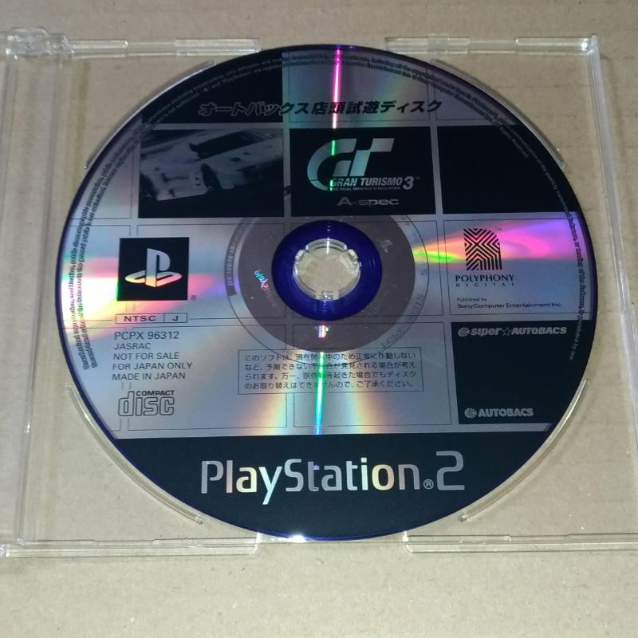

## GT 2000 Tokyo Games Show 1999 Version (~Sep ??, 1999)

:material-shovel: *Dumped*: :x: {==No==}

??? youtube "Video"
    <iframe width="961" height="721" src="https://www.youtube.com/embed/I-vH-EW4Jrg" title="PlayStation 2 at TGS 1999 [Extended] Tekken, Gran Turismo 2000, Dark Cloud, Bouncer &amp; More, Tokyo 99" frameborder="0" allow="accelerometer; autoplay; clipboard-write; encrypted-media; gyroscope; picture-in-picture; web-share" allowfullscreen></iframe>

---

## GT 2000 (Feb. 13, 2000)

{ width="250"}

:material-shovel: *Dumped*: {++Yes++} - available on [Hidden Palace](https://hiddenpalace.org/Gran_Turismo_2000_(Feb_13,_2000_demo)) · :material-disc: [Redump Info](http://redump.org/disc/26639/)

Game Code: `PAPX-90203`

??? abstract "File List"
    * [Contents + GT2K.VOL](file_lists/PAPX-90203.txt)

??? note "Build Info"
    * Has PDI-GL (rendering lib) asserts, which are removed in later builds/games (`PDI-GL Ver.1.01d,00111,16,2,2,Feb 14 2000,08:40:04`)

??? youtube "Video by [Paiky/GT Archive](https://www.youtube.com/@GTArchivePaiky)"
    <iframe width="915" height="721" src="https://www.youtube.com/embed/3MaPYMz_TB8" title="Gran Turismo 2000 | PAPX-90203 | Feb 13, 2000" frameborder="0" allow="accelerometer; autoplay; clipboard-write; encrypted-media; gyroscope; picture-in-picture; web-share" allowfullscreen></iframe>

---

## GT 2000 Tokyo Game Show Autumn Build (Late March ??, 2000)

:material-shovel: *Dumped*: :x: {==No==}

Deep Forest & Seattle are shown. Time limited build.

??? youtube "Video"
    <iframe width="953" height="715" src="https://www.youtube.com/embed/7bbqBMm9gGw?start=4713" title="ECTS London &amp; Tokyo Game Show Autumn [2000] [Polish Press] [VHS Rip]" frameborder="0" allow="accelerometer; autoplay; clipboard-write; encrypted-media; gyroscope; picture-in-picture; web-share" allowfullscreen></iframe>

---

## GT 2000 E3 Build (~May ??, 2000)

:material-shovel: *Dumped*: :x: {==No==}

??? youtube "Video"
    <iframe width="1280" height="720" src="https://www.youtube.com/embed/FN9m2W_lvP8" title="Gran Turismo 2000 - E3 2000 footage" frameborder="0" allow="accelerometer; autoplay; clipboard-write; encrypted-media; gyroscope; picture-in-picture; web-share" allowfullscreen></iframe>

---

## GT3 Replay Theater Autobacs Seven (Sep 26, 2000)

{ width="250"}

:material-shovel: *Dumped*: {++Yes++} - available on [archive](https://archive.org/details/sony_playstation2_g) · :material-disc: [Redump Info](http://redump.org/disc/75434/)

Game Code: `PAPX-90207`

??? abstract "File List"
    * [Contents + GT2K.VOL](file_lists/PAPX-90207.txt)

??? note "Build Info"
    * Has PDI-GL (rendering lib) asserts, which are removed in later builds/games (`PDI-GL Ver.1.01d,00111,16,2,2,Sep 25 2000,20:01:00`)

??? youtube "Video by [Paiky/GT Archive](https://www.youtube.com/@GTArchivePaiky)"
    <iframe width="919" height="721" src="https://www.youtube.com/embed/HRx_nALGv_w" title="Gran Turismo 3 Replay Theater Autobacs Seven | PAPX-90207 | Sep 26, 2000" frameborder="0" allow="accelerometer; autoplay; clipboard-write; encrypted-media; gyroscope; picture-in-picture; web-share" allowfullscreen></iframe>

??? youtube "Hidden/Beta Tracks"
    <iframe width="919" height="721" src="https://www.youtube.com/embed/5QGMapRW5hA" title="Hidden/Beta Tracks | Gran Turismo 3 Replay Theater Autobacs Seven | PAPX-90207 (On real Hardware)" frameborder="0" allow="accelerometer; autoplay; clipboard-write; encrypted-media; gyroscope; picture-in-picture; web-share" allowfullscreen></iframe>
---

## GT3 Store Trial Disk Autobacs (Oct 3, 2000)

{ width="250"}

:material-shovel: *Dumped*: {++Yes++} - available on [archive](https://archive.org/details/image0_20250327) · :material-disc:[Redump Info](http://redump.org/disc/75594/)

Game Code: `PAPX-96312`

??? abstract "File List"
    * [Contents + GT2K.VOL](file_lists/PAPX-96312.txt)

??? note "Build Info"
    * Has PDI-GL (rendering lib) asserts, which are removed in later builds/games (`"sub_1818D0("PDI-GL Ver.%u.%02u%c,%s,Oct  3 2000,20:27:15,", 1, 1, 100, "00111,16,2,2")`)

---

## GT3 Replay Theater (Oct 5, 2000)

{ width="250"}

:material-shovel: *Dumped*: {++Yes++} - available on [archive](https://archive.org/details/sony_playstation2_g) · :material-disc: [Redump Info](http://redump.org/disc/38277/)

Game Code: `PAPX-90208`

??? abstract "File List"
    * [Contents + GT2K.VOL](file_lists/PAPX-90208.txt)

??? note "Build Info"
    * Has PDI-GL (rendering lib) asserts, which are removed in later builds/games (`PDI-GL Ver.1.01d,00111,16,2,2,Oct  3 2000,20:27:15`)

---

## GT3 Replay Theater Netz Toyota (Oct 9, 2000)

{ width="250"}

:material-shovel: *Dumped*: {++Yes++} - available on [archive](https://archive.org/details/sony_playstation2_g) · :material-disc: [Redump Info](http://redump.org/disc/75435/)

Game Code: `PAPX-90209`

---

## GT3 Netz Toyota Dealership Demo (Oct 9, 2000)

:material-shovel: *Dumped*: {++Yes++} - available on [archive](https://archive.org/details/gt3-toyota-netz-pcpx-96309) · :material-disc: No Redump Info

Game Code: `PCPX-96309`

Volume contents is identical to `PAPX-90209`

??? youtube "Video"
    <iframe width="1280" height="720" src="https://www.youtube.com/embed/qmLJdKesTrw" title="Gran Turismo 3 Netz Toyota Dealership Demo PCPX-96309 Gameplay" frameborder="0" allow="accelerometer; autoplay; clipboard-write; encrypted-media; gyroscope; picture-in-picture; web-share" allowfullscreen></iframe>

---

## GT3 A-Spec Store Demo Vol.1 (Oct 10, 2000)

{ width="250"}

:material-shovel: *Dumped*: {++Yes++} - available on [archive](https://archive.org/details/gran-turismo-3-trial-disk-pcpx-96311) · :material-disc: [Redump Info](http://redump.org/disc/75593/)

Game Code: `PCPX-96311`

??? abstract "File List"
    * [Contents + GT2K.VOL](file_lists/PCPX-96311.txt)

??? note "Build Info"
    * Has PDI-GL (rendering lib) asserts, which are removed in later builds/games (`PDI-GL Ver.1.01d,00111,16,2,2,Oct  9 2000,13:46:19`)
    * Has some code for HostFS

??? youtube "Video by [Paiky/GT Archive](https://www.youtube.com/@GTArchivePaiky)"
    <iframe width="917" height="721" src="https://www.youtube.com/embed/gqBHJ1JeLdQ" title="Gran Turismo 3: A-Spec Store Demo Vol.1 | PCPX-96311 | Oct 10, 2000" frameborder="0" allow="accelerometer; autoplay; clipboard-write; encrypted-media; gyroscope; picture-in-picture; web-share" allowfullscreen></iframe>

---

## GT3 NTSC Demo (Oct 30, 2000)

{ width="250"}

:material-shovel: *Dumped*: {++Yes++} - available on [archive](https://archive.org/details/sony_playstation2_g) · :material-disc: [Redump Info](http://redump.org/disc/45090/)

Game Code: `SCUS-97115`

---

## PurePure 2 Volume 0: 2001 February (Nov. 19, 2000)

:material-shovel: *Dumped*: {++Yes++} - available on [archive](https://archive.org/details/purepure2volume0) · :material-disc: [Redump Info](http://redump.org/disc/33533/)

Game Code: `PCPX-96606`

---

## Official PlayStation 2 Magazine Demo 5 (Nov. 19, 2000)

{ width="250"}

:material-shovel: *Dumped*: {++Yes++} - available on [archive](https://archive.org/details/sony_playstation2_o_part1) · :material-disc: [Redump Info](http://redump.org/disc/4594/)

Game Code: `SCED-50140`

Volume contents is identical to `PCPX-96606`.

---

## GT3 A-Spec Store Demo Vol.2 (Dec 29, 2000)

{ width="250"}

:material-shovel: *Dumped*: {++Yes++} - available on [archive](https://archive.org/details/GranTurismo3-Demo-Archive) · :material-disc: [Redump Info](http://redump.org/disc/80183/)

Game Code: `PCPX-96609`

??? abstract "File List"
    * [ISO + GT3.VOL](file_lists/PCPX-96609.txt)

??? note "Build Info"
    * ISO Size: `834 MB`
    * ISO CRC: `2B6AA922`
    * Has some code for HostFS

??? youtube "Video by [Paiky/GT Archive](https://www.youtube.com/@GTArchivePaiky)"
    <iframe width="1280" height="720" src="https://www.youtube.com/embed/vhnZSF1dPAg" title="Gran Turismo 3: A-Spec Store Demo Vol.2 | PCPX-96609 | Dec 29, 2000" frameborder="0" allow="accelerometer; autoplay; clipboard-write; encrypted-media; gyroscope; picture-in-picture; web-share" allowfullscreen></iframe>

??? youtube "Hidden/Beta Content"
    <iframe width="1280" height="720" src="https://www.youtube.com/embed/NaUuc1GUAh8" title="Hidden/Beta Content | Gran Turismo 3 Store Demo Vol. 2 | PCPX-96609 (On real Hardware) [60FPS]" frameborder="0" allow="accelerometer; autoplay; clipboard-write; encrypted-media; gyroscope; picture-in-picture; web-share" allowfullscreen></iframe>

---

## Preview Version NTSC GT3 A-Spec (Apr. 18, 2001)

:material-shovel: *Dumped*: {++Yes++} - available on [archive](https://archive.org/details/gran-turismo-3-a-spec-apr-18-2001-prototype) · :material-disc: No Redump Info

Game Code: `SCPS-15009`

A build of GT3 A-Spec dated a day before the final NTSC-J retail. While it has different mastering, contentwise it appears to be identical to release.

---

## Gran Turismo 3 (Apr. 18, 2001)

{ width="250"}

:material-shovel: *Dumped*: {++Yes++}

The main build of Gran Turismo 3.

* JP Game Code: `SCPS-15009`
* US Game Code: `SCUS-97102` / `PBPX-95503`
* EU Game Code: `SCES-50294`

??? abstract "File List"
    * SCES-50294 - [ISO + GT3.VOL](file_lists/SCES-50294.txt)
    * SCUS-91702 - [ISO + GT3.VOL](file_lists/SCUS-91702.txt)
    * SCPS-15009 - [ISO + GT3.VOL](file_lists/SCPS-15009.txt)

??? note ":flag_eu: SCES-50294"
    * ISO Size: `3.43 GB`
    * ISO CRC: `FA111523`
    * Has some code for HostFS

??? note ":flag_us: SCES-50294"
    * ISO Size: `3.61 GB`
    * ISO CRC: `AE611D2EAE611D2E`
    * Has some code for HostFS

??? note ":flag_jp: SCPS-15009"
    * ISO Size: `2.36 GB`
    * ISO CRC: `34381D7D`
    * Has some code for HostFS