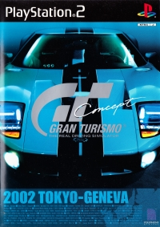
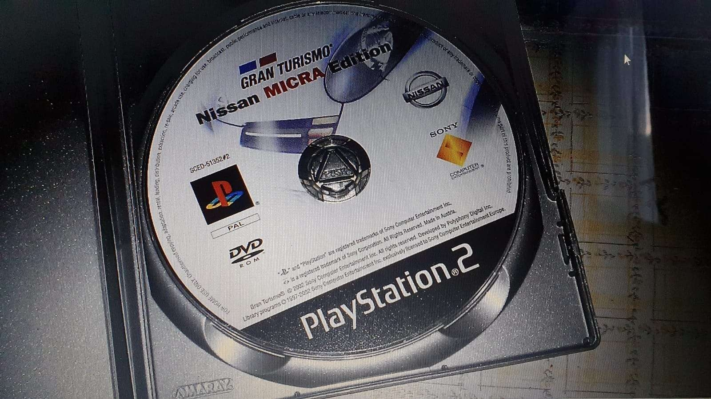

## "Nissan GT-R Concept" Tokyo Motorshow Demo Version (Oct ??, 2001)

:material-shovel: *Dumped*: :x: {==No==} · :material-disc: No Redump Info

Mentioned in [Notable Gran Turismo Collaborations](../images/covers/gt3c_notable_collaborations.png)

---

## "Honda DUALNOTE" Tokyo Motorshow Demo Version (Oct ??, 2001)

:material-shovel: *Dumped*: :x: {==No==} · :material-disc: No Redump Info

Mentioned in [Notable Gran Turismo Collaborations](../images/covers/gt3c_notable_collaborations.png)

---

## "Toyota pod" Tokyo Motorshow Demo Version (Oct ??, 2001)

:material-shovel: *Dumped*: :x: {==No==} · :material-disc: No Redump Info

Mentioned in [Notable Gran Turismo Collaborations](../images/covers/gt3c_notable_collaborations.png)

---

## "Suzuki GSX-R/4" Tokyo Motorshow Demo Version (Oct ??, 2001)

:material-shovel: *Dumped*: :x: {==No==} · :material-disc: No Redump Info

Mentioned in [Notable Gran Turismo Collaborations](../images/covers/gt3c_notable_collaborations.png)

---

## Gran Turismo Concept: 2001 Tokyo Store Demo (Dec 9th, 2001)

{ width="250" }

:material-shovel: *Dumped*: {++Yes++} - available on [archive](https://archive.org/details/pcpx-96624) · :material-disc: [Redump Info](http://redump.org/disc/23177/)

Game Code: `PCPX-96624`

Contents identical to retail.

---

## Gran Turismo Concept - 2002 Tokyo-Seoul (Mar 20th, 2002)

{ width="250" }

:material-shovel: *Dumped*: {++Yes++} - available on [archive](https://archive.org/details/sony_playstation2_g) · :material-disc: [Redump Info](http://redump.org/disc/80596/)

Game Code: `SCPS-56005` (1.02, 2.00)

??? abstract "File List"
    * SCPS-56005 - [ISO + VOL](file_lists/SCPS-56005.txt)
    * SCPS-56005 (2.00) - [ISO + VOL](file_lists/SCPS-56005_2.00.txt)

??? note "Build Info"
    * Game Code: `SCPS-56005`
    * Uses V2.2 [Volume](../concepts/volume.md) TOC (GT3-type volume)
    * Bootstrap + Core executables
    * ISO Size: `3.77` (DVD9/Dual Layer. Layer0 is audio/videos, Layer1 is game contents)
    * ISO CRC: `06DB23F4` (1.02), `5CFD0575` (2.00)

---

## Gran Turismo Concept Copen Special Edition (Mar 25th, 2002)

{ width="250" }

:material-shovel: *Dumped*: {++Yes++} - available on [archive](https://archive.org/details/GTC_Concept_Copen_Special) · :material-disc: [Redump Info](http://redump.org/disc/48486/)

Game Code: `SCPM-85301`

??? abstract "File List"
    * [ISO + VOL](file_lists/SCPM-85301.txt)

??? note "Build Info"
    * Game Code: `SCPM-85301`
    * Uses V2.2 [Volume](../concepts/volume.md) TOC (GT3-type volume)
    * Unified executable
    * ISO Size: `3.78 GB`
    * ISO CRC: `DCC99A3F`

??? youtube "Video by [Paiky/GT Archive](https://www.youtube.com/@GTArchivePaiky)"
    <iframe width="626" height="369" src="https://www.youtube.com/embed/H7ki9j4UvaU" title="Gran Turismo Concept Copen Special Edition | SCPM-85301 | Mar 25, 2002" frameborder="0" allow="accelerometer; autoplay; clipboard-write; encrypted-media; gyroscope; picture-in-picture; web-share" allowfullscreen></iframe>

---

## Gran Turismo Concept - Nissan 350Z Edition (May 1, 2002)

{ width="250" }

:material-shovel: *Dumped*: {++Yes++} - available on [archive](https://archive.org/details/sony_playstation2_g) · :material-disc: [Redump Info](http://redump.org/disc/80593/)

Game Code: `SCUS-97219`

??? abstract "File List"
    * [ISO + VOL](file_lists/SCUS-97219.txt)

??? note "Build Info"
    * Game Code: `SCUS-97219`
    * Uses V2.2 [Volume](../concepts/volume.md) TOC (GT3-type volume)
    * Unified executable
    * ISO Size: `3.81 GB`
    * ISO CRC: `1ACC0BA6`

??? youtube "Video by [Paiky/GT Archive](https://www.youtube.com/@GTArchivePaiky)"
    <iframe width="812" height="480" src="https://www.youtube.com/embed/8L40Ax8RH1Q" title="Gran Turismo Concept - Nissan 350Z Edition | SCUS-97219 | May 1, 2002" frameborder="0" allow="accelerometer; autoplay; clipboard-write; encrypted-media; gyroscope; picture-in-picture; web-share" allowfullscreen></iframe>

---

## Gran Turismo Concept Mitsubishi Airtrek Turbo Special Edition (May 16th, 2002)

{ width="250" }

:material-shovel: *Dumped*: {++Yes++} - available on [archive](https://archive.org/details/gtcairtrektrial) · :material-disc: [Redump Info](http://redump.org/disc/75449/)

Game Code: `PAPX-90504`

??? abstract "File List"
    * [ISO + VOL](file_lists/PAPX-90504.txt)

??? note "Build Info"
    * Game Code: `PAPX-90504`
    * Uses V2.2 [Volume](../concepts/volume.md) TOC (GT3-type volume)
    * Unified executable
    * ISO Size: `3.95 GB`
    * ISO CRC: `4805C587`

??? youtube "Video by [Paiky/GT Archive](https://www.youtube.com/@GTArchivePaiky)"
    <iframe width="1226" height="721" src="https://www.youtube.com/embed/m4bd-SBgHGs" title="Gran Turismo Concept Mitsubishi Airtrek Turbo Special Edition | PAPX-90504 | May 16, 2002" frameborder="0" allow="accelerometer; autoplay; clipboard-write; encrypted-media; gyroscope; picture-in-picture; web-share" allowfullscreen></iframe>
---

## Gran Turismo Concept - 2002 Tokyo-Geneva (June 25th, 2002)

{ width="250" }

:material-shovel: *Dumped*: {++Yes++} - available on [archive](https://archive.org/details/sony_playstation2_g) · :material-disc: [Redump Info](http://redump.org/disc/62229/)

* :flag_jp: `SCPS-55902`
* :flag_eu: `SCES-50858`

??? abstract "File List"
    * SCPS-55902 - [ISO + VOL](file_lists/SCPS-55902.txt)
    * SCES-50858 - [ISO + VOL](file_lists/SCES-50858.txt)

??? note "Build Info ( :flag_jp: SCPS-55902)"
    * Game Code: `SCPS-55902`
    * Uses V2.2 [Volume](../concepts/volume.md) TOC (GT3-type volume)
    * Bootstrap + Core executables
    * ISO Size: `7.93 GB` (DVD9/Dual Layer. Layer0 is audio/videos, Layer1 is game contents)
    * ISO CRC: `97534BFB`

??? note "Build Info ( :flag_eu: SCES-50858)"
    * Game Code: `SCES-50858`
    * Uses V2.2 [Volume](../concepts/volume.md) TOC (GT3-type volume)
    * Bootstrap + Core executables
    * ISO Size: `3.41 GB`
    * ISO CRC: `96D26314`

    
---

## Gran Turismo Nissan Micra Edition (October 4, 2002)

{ width="250" }

:material-shovel: *Dumped*: {++Yes++} - available on [archive](https://archive.org/details/sony_playstation2_g) · :material-disc: Entries exist on Redump, ISO CRC does not match

Game Code: `SCED-51352`

??? abstract "File List"
    * [ISO + VOL](file_lists/SCED-51352.txt)

??? note "Build Info"
    * Game Code: `SCED-51352`
    * Uses V2.2 [Volume](../concepts/volume.md) TOC (GT3-type volume)
    * Unified executable
    * ISO Size: `3.42 GB`
    * ISO CRC: `949DC7C3`
    * Has HostFS implementation

??? youtube "Video by [Paiky/GT Archive](https://www.youtube.com/@GTArchivePaiky)"
    <iframe width="1280" height="720" src="https://www.youtube.com/embed/CEuMiSavzW8" title="Gran Turismo Nissan Micra Edition | SCED-51352 | Okt 4, 2002" frameborder="0" allow="accelerometer; autoplay; clipboard-write; encrypted-media; gyroscope; picture-in-picture; web-share" allowfullscreen></iframe>

---

## "ALFA ROMEO 147GTA" Special Edition Demo : Torino Motorshow (Dec ??, 2002)

:material-shovel: *Dumped*: :x: {==No==} · :material-disc: No Redump Info

Mentioned in [Notable Gran Turismo Collaborations](../images/covers/gt3c_notable_collaborations.png)

---

## Gran Turismo Nissan Micra Edition Rev 2 (Dec 18, 2002)

{ width="250" }

:material-shovel: *Dumped*: {++Yes++} - available on [archive](https://archive.org/details/sony_playstation2_g) · :material-disc: Entries exist on Redump, ISO CRC does not match

Game Code: `SCED-51352#2`

??? abstract "File List"
    * [ISO + VOL](file_lists/SCED-51352_Rev2.txt)

??? note "Build Info"
    * Game Code: `SCED-51352#2`
    * Uses V2.2 [Volume](../concepts/volume.md) TOC (GT3-type volume)
    * Unified executable
    * ISO Size: `3.42 GB`
    * ISO CRC: `03549184`
    * Has HostFS implementation
    * Has some `.gnu_linkonce` symbols
---

## Gran Turismo: LUPO CUP Training Version 1 (Apr ??, 2003)

{ width="250" }

:material-shovel: *Dumped*: :x: {==No==} · :material-disc: [Redump Info](http://redump.org/disc/99961/)

Game Code: `PAPX-90508`

---

## Gran Turismo: LUPO CUP Training Version 2 (Apr ??, 2003)

{ width="250" }

:material-shovel: *Dumped*: :x: {==No==} · :material-disc: No Redump Info

Game Code: `PAPX-90509`

??? youtube "Video"
    <iframe width="1180" height="664" src="https://www.youtube.com/embed/WEsWukxZDQg" title="Gran Turismo Concept Lupo Cup Ver2 Play(Replay)" frameborder="0" allow="accelerometer; autoplay; clipboard-write; encrypted-media; gyroscope; picture-in-picture; web-share" allowfullscreen></iframe>

---

## Gran Turismo: Subaru Driving Simulator (May 17, 2003)

{ width="250" }

:material-shovel: *Dumped*: :x: {==No==} · :material-disc: [Redump Info](http://redump.org/disc/98890/)

Game Code: `PCPX-96634`

