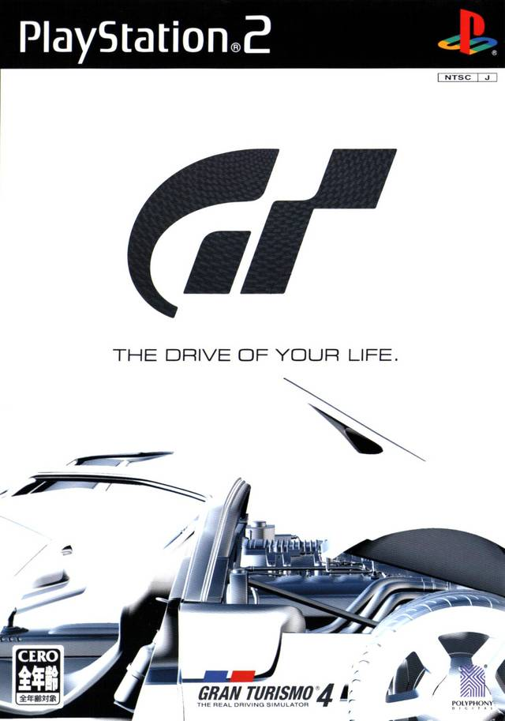

After many iterations and demos of Gran Turismo 4 Prologue, GT4 was finally released after its move to Adhoc was completed. It is one of the first few games to ship running on a scripting engine this extensively.

## GT4 E3 2004 (May ??, 2004)

:material-shovel: *Dumped*: :x: {==No==}

??? youtube "Video"
    <iframe width="400" height="293" src="https://www.youtube.com/embed/rDIth1LG1So" title="Gran Turismo 4 - Demo Walkthrough E3 2004" frameborder="0" allow="accelerometer; autoplay; clipboard-write; encrypted-media; gyroscope; picture-in-picture; web-share" allowfullscreen></iframe>

---

## GT4 BMW 1 Series Virtual Drive (Jun 18, 2004)

{ width="200" }

:material-shovel: *Dumped*: {++Yes++} - available on [archive](https://archive.org/details/sony_playstation2_g) · :material-disc: [Redump Info](http://redump.org/disc/70043/)

Game Code: `SCED-52681`

??? abstract "File List"
    * [ISO + VOL](file_lists/SCED-52681.txt)

??? note "Build Info"
    * Adhoc Version: `5`
    * Supports up to instruction: `36 - VARIABLE_PUSH`
    * VersionBranch: `bmw`
    * BuildNumber: `614`
    * Game Code: `SCED-52681`
    * Uses V3.1 [Volume](../concepts/volume.md) TOC (GT4-type volume)
    * Unified executable
    * ISO Size: `1.21 GB`
    * ISO CRC: `41AD3798`

??? youtube "Video by [Paiky/GT Archive](https://www.youtube.com/@GTArchivePaiky)"
    <iframe width="1180" height="664" src="https://www.youtube.com/embed/dKi9vvwwXwM" title="Gran Turismo 4 BMW 1 Series Virtual Drive | SCED-52681 | 18 Jun, 2004" frameborder="0" allow="accelerometer; autoplay; clipboard-write; encrypted-media; gyroscope; picture-in-picture; web-share" allowfullscreen></iframe>

---

## GT4 BMW 1 Series Virtual Drive Dealership (Jun 18, 2004)

{ width="200" }

:material-shovel: *Dumped*: {++Yes++} - available on [archive](https://archive.org/details/sony_playstation2_g) · :material-disc: [Redump Info](http://redump.org/disc/70043/)

Game Code: `SCED-52578`

Same build as above, with a time limit.

??? abstract "File List"
    * [ISO + VOL](file_lists/SCED-52578.txt)

??? note "Build Info"
    * Adhoc Version: `5`
    * Supports up to instruction: `36 - VARIABLE_PUSH`
    * VersionBranch: `bmwd`
    * BuildNumber: `615`
    * Game Code: `SCED-52578`
    * Uses V3.1 [Volume](../concepts/volume.md) TOC (GT4-type volume)
    * Unified executable
    * ISO Size: `1.21 GB`
    * ISO CRC: `082729CF`

??? youtube "Video by [Paiky/GT Archive](https://www.youtube.com/@GTArchivePaiky)"
    <iframe width="1180" height="664" src="https://www.youtube.com/embed/VxjN_30_95U?list=PLXiAEH9wPLwup_xJd3xgorb4ZPzHXcFXF" title="Gran Turismo 4 BMW 1 Series Virtual Drive Dealership | SCED-52578 | 18 Jun, 2004" frameborder="0" allow="accelerometer; autoplay; clipboard-write; encrypted-media; gyroscope; picture-in-picture; web-share" allowfullscreen></iframe>

---

## GT4 Tokyo Game Show (Sept ??, 2004)

:material-shovel: *Dumped*: :x: {==No==}

??? youtube "Video"
    <iframe width="953" height="715" src="https://www.youtube.com/embed/qEs0OohYojc?start=862" title="Tokyo Game Show 2004  Gamepro 2004/12" frameborder="0" allow="accelerometer; autoplay; clipboard-write; encrypted-media; gyroscope; picture-in-picture; web-share" allowfullscreen></iframe>

---

## GT4 First Preview (Sep 20, 2004)

{ width="200" }

:material-shovel: *Dumped*: {++Yes++} - available on [archive](https://archive.org/details/gt4firstpreview) · :material-disc: [Redump Info](http://redump.org/disc/41243/)

Game Code: `PCPX-96649`

??? abstract "File List"
    * [ISO + VOL](file_lists/PCPX-96649.txt)

??? note "Build Info"
    * Adhoc Version: `5`
    * Supports up to instruction: `36 - VARIABLE_PUSH`
    * VersionBranch: `august`
    * VersionString: `r0001`
    * BuildNumber: `674`
    * Game Code: `PCPX-96649`
    * Uses V3.1 [Volume](../concepts/volume.md) TOC (GT4-type volume)
    * Unified executable
    * ISO Size: `1.22 GB`
    * ISO CRC: `828AFE7D`

??? youtube "Video by [Paiky/GT Archive](https://www.youtube.com/@GTArchivePaiky)"
    <iframe width="1218" height="721" src="https://www.youtube.com/embed/UpzUtp-RZRA" title="Gran Turismo 4 First Preview | PCPX-96649 | Sep 20, 2004" frameborder="0" allow="accelerometer; autoplay; clipboard-write; encrypted-media; gyroscope; picture-in-picture; web-share" allowfullscreen></iframe>

---

## GT4

{ width="200" }
{ width="200" }

:material-shovel: *Dumped*: {++Yes++}

The main build of Gran Turismo 4.

- :earth_asia: `SCAJ-30007` (Dec 15, 2004)
- :flag_jp: `SCPS-17001` (Dec 17, 2004)
- :flag_eu: `SCES-51719` (Jan 26, 2005)
- :flag_us: `SCUS-97328` (1.01) (Jan 26, 2005)
- :flag_kr: `SCKA-30001` (Jan 30, 2005)
- :flag_us: `SCUS-97328` (2.00) (Oct 18, 2006)

??? abstract "File List"
    * SCAJ-30007 - [ISO + VOL](file_lists/SCAJ-30007.txt)
    * SCPS-17001 - [ISO + VOL](file_lists/SCPS-17001.txt)
    * SCES-51719 - [ISO + VOL](file_lists/SCES-51719.txt)
    * SCUS-97328 1.01 - [ISO + VOL](file_lists/SCUS-97328_1.01.txt)
    * SCKA-30001 - [ISO + VOL](file_lists/SCKA-30001.txt)
    * SCUS-97328 2.00 - [ISO + VOL](file_lists/SCUS-97328_2.00.txt)

??? note "Build Info ( :earth_asia: SCAJ-30007)"
    * Adhoc Version: `5`
    * Supports up to instruction: `36 - VARIABLE_PUSH`
    * VersionBranch: `main`
    * VersionString: `r0001`
    * BuildNumber: `358`
    * Uses V3.1 [Volume](../concepts/volume.md) TOC (GT4-type volume)
    * Bootstrap + Core executables
    * ISO Size: `5.70 GB` (Dual Layer/DVD9)
    * ISO CRC32: `AD8AA6C9`
    
??? note "Build Info ( :flag_jp: SCPS-17001)"
    * Adhoc Version: `5`
    * Supports up to instruction: `36 - VARIABLE_PUSH`
    * VersionBranch: `main`
    * VersionString: `r0001`
    * BuildNumber: `366`
    * Uses V3.1 [Volume](../concepts/volume.md) TOC (GT4-type volume)
    * Bootstrap + Core executables
    * ISO Size: `6.16 GB` (Dual Layer/DVD9)
    * ISO CRC32: `14285442`

??? note "Build Info ( :flag_eu: SCES-51719)"
    * Adhoc Version: `5`
    * Supports up to instruction: `36 - VARIABLE_PUSH`
    * VersionBranch: `main`
    * VersionString: `r0001`
    * BuildNumber: `1010`
    * Uses V3.1 [Volume](../concepts/volume.md) TOC (GT4-type volume)
    * Bootstrap + Core executables
    * ISO Size: `5.27 GB` (Dual Layer/DVD9)
    * ISO CRC32: `E1CA4D84`

??? note "Build Info ( :flag_us: SCUS-97328) 1.01"
    * Adhoc Version: `5`
    * Supports up to instruction: `36 - VARIABLE_PUSH`
    * VersionBranch: `main`
    * VersionString: `r0001`
    * BuildNumber: `415`
    * Uses V3.1 [Volume](../concepts/volume.md) TOC (GT4-type volume)
    * Bootstrap + Core executables
    * ISO Size: `4.94 GB` (Dual Layer/DVD9)
    * ISO CRC32: `D1D25931`

??? note "Build Info ( :flag_kr: SCKA-30001)"
    * Adhoc Version: `5`
    * Supports up to instruction: `36 - VARIABLE_PUSH`
    * VersionBranch: `main`
    * VersionString: `r0001`
    * BuildNumber: `1016`
    * Uses V3.1 [Volume](../concepts/volume.md) TOC (GT4-type volume)
    * Bootstrap + Core executables
    * ISO Size: `5.00 GB` (Dual Layer/DVD9)
    * ISO CRC32: `02C25ED0`

??? note "Build Info ( :flag_us: SCUS-97328) 2.00"
    * Adhoc Version: `5`
    * Supports up to instruction: `36 - VARIABLE_PUSH`
    * VersionBranch: `main`
    * VersionString: `r0001`
    * BuildNumber: `415`
    * Uses V3.1 [Volume](../concepts/volume.md) TOC (GT4-type volume)
    * Bootstrap + Core executables
    * ISO Size: `4.94 GB` (Dual Layer/DVD9)
    * ISO CRC32: `831F9F84`

---

## GT4 - Mazda MX-5 Edition Demo (Feb 22, 2005)

{ width="200" }

:material-shovel: *Dumped*: {++Yes++} - available on [archive](https://archive.org/details/sony_playstation2_g) · :material-disc: [Redump Info](http://redump.org/disc/56788/)

Game Code: `SCUS-97483`

Despite being rather large in size, it only allows access to three tracks: Tsukuba, Laguna Seca and Côte d'Azur. All of GT4's content is still present inside its volume.

??? abstract "File List"
    * [ISO + VOL](file_lists/SCUS-97483.txt)

??? note "Build Info"
    * Adhoc Version: `5`
    * Supports up to instruction: `36 - VARIABLE_PUSH`
    * VersionBranch: `mazda`
    * VersionString: `r0001`
    * BuildNumber: `3513`
    * Game Code: `SCUS-97483`
    * Uses V3.1 [Volume](../concepts/volume.md) TOC (GT4-type volume)
    * Unified executable
    * ISO Size: `2.71 GB`
    * ISO CRC: `EB51F54A`

---

## GT4 - China Press Copy (May 20th, 2005)

:material-shovel: *Dumped*: {++Yes++} - available on [archive](https://archive.org/details/granturismo4china) · :material-disc: [Redump Info](http://redump.org/disc/36703/)

Game Code: `SCCS-60062`

??? abstract "File List"
    * [ISO + VOL](file_lists/SCCS-60002.txt)

??? note "Build Info"
    * Adhoc Version: `5`
    * Supports up to instruction: `36 - VARIABLE_PUSH`
    * VersionBranch: `main`
    * VersionString: `r0001`
    * BuildNumber: `50`
    * Game Code: `SCCS-60002`
    * Uses V3.1 [Volume](../concepts/volume.md) TOC (GT4-type volume)
    * Bootstrap + Core executables
    * ISO Size: `5.33 GB` (Dual Layer/DVD9)
    * ISO CRC: `0A806E05`
---

## GT4 - Online Test Version (May 2nd, 2006)

{ width="200" }

:material-shovel: *Dumped*: {++Yes++} - available on [archive](https://archive.org/download/sony_playstation2_g) · :material-disc: [Redump Info](http://redump.org/disc/62270/)

Game Code: `PAPX-90523`

All around improved version of GT4. Runs on a newer version of Adhoc, has proper widescreen support and Online functionality. It does not bundle videos; but is relatively small in size.

??? abstract "File List"
    * [ISO + VOL](file_lists/SCUS-97436.txt)

??? note "Build Info"
    * Adhoc Version: `7`
    * Supports up to instruction: `39 - SOURCE_FILE`
    * VersionBranch: `beta`
    * VersionString: `r0001`
    * BuildNumber: `50`
    * Game Code: `PAPX-90523`
    * Uses V3.1 [Volume](../concepts/volume.md) TOC (GT4-type volume)
    * Bootstrap + Core executables
    * ISO Size: `3.30 GB`
    * ISO CRC: `7C01EE57`

---

## GT4 - Online Public Beta (June 6th, 2006)

{ width="200" }

:material-shovel: *Dumped*: {++Yes++} - available on [archive](https://archive.org/details/gran-turismo-4-usa-beta) · :material-disc: No Redump Info

Game Code: `SCUS-97436`

US version of the Online Test Version, released a month later.

??? abstract "File List"
    * [ISO + VOL](file_lists/SCUS-97436.txt)

??? note "Build Info"
    * Adhoc Version: `7`
    * Supports up to instruction: `39 - SOURCE_FILE`
    * VersionBranch: `beta`
    * VersionString: `r0001`
    * BuildNumber: `76`
    * Game Code: `SCUS-97436`
    * Uses V3.1 [Volume](../concepts/volume.md) TOC (GT4-type volume)
    * Bootstrap + Core executables
    * ISO Size: `2.47 GB`
    * ISO CRC: `E8BF4147`
