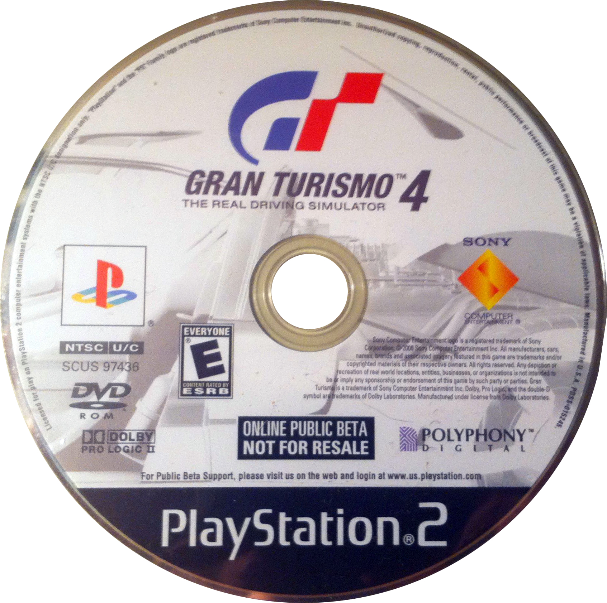

After many iterations and demos of Gran Turismo 4 Prologue, GT4 was finally released after its move to Adhoc was completed. It is one of the first few games to ship running on a scripting engine this extensively.

## GT4 BMW 1 Series Virtual Drive (Jun 18, 2004)

{ width="200" }

:material-shovel: *Dumped*: {++Yes++} - available on [archive](https://archive.org/details/sony_playstation2_g) · :material-disc: [Redump Info](http://redump.org/disc/70043/)

Game Code: `SCED-52681`

??? abstract "File List"
    * [ISO + VOL](file_lists/SCED-52578.txt)

??? note "Build Info"
    * Adhoc Version: `5`
    * Supports up to instruction: `36 - VARIABLE_PUSH`
    * VersionBranch: `bmw`
    * BuildNumber: `614`
    * Game Code: `SCED-52681`
    * Uses V3.1 [Volume](../concepts/volume.md) TOC (GT4-type volume)
    * Unified executable
    * ISO Size: `1.21 GB`
    * ISO CRC: `41AD3798`

??? youtube "Video by [Paiky/GT Archive](https://www.youtube.com/@GTArchivePaiky)"
    <iframe width="1180" height="664" src="https://www.youtube.com/embed/dKi9vvwwXwM" title="Gran Turismo 4 BMW 1 Series Virtual Drive | SCED-52681 | 18 Jun, 2004" frameborder="0" allow="accelerometer; autoplay; clipboard-write; encrypted-media; gyroscope; picture-in-picture; web-share" allowfullscreen></iframe>

---

## GT4 BMW 1 Series Virtual Drive Dealership (Jun 18, 2004)

{ width="200" }

:material-shovel: *Dumped*: {++Yes++} - available on [archive](https://archive.org/details/sony_playstation2_g) · :material-disc: [Redump Info](http://redump.org/disc/70043/)

Game Code: `SCED-52578`

Same build as above, with a time limit.

??? note "Build Info"
    * Adhoc Version: `5`
    * Supports up to instruction: `36 - VARIABLE_PUSH`
    * VersionBranch: `bmwd`
    * BuildNumber: `615`
    * Game Code: `SCED-52578`
    * Uses V3.1 [Volume](../concepts/volume.md) TOC (GT4-type volume)
    * Unified executable
    * ISO Size: `1.21 GB`
    * ISO CRC: `082729CF`

??? youtube "Video by [Paiky/GT Archive](https://www.youtube.com/@GTArchivePaiky)"
    <iframe width="1180" height="664" src="https://www.youtube.com/embed/VxjN_30_95U?list=PLXiAEH9wPLwup_xJd3xgorb4ZPzHXcFXF" title="Gran Turismo 4 BMW 1 Series Virtual Drive Dealership | SCED-52578 | 18 Jun, 2004" frameborder="0" allow="accelerometer; autoplay; clipboard-write; encrypted-media; gyroscope; picture-in-picture; web-share" allowfullscreen></iframe>

---

## GT4 First Preview (Sep 20, 2004)

{ width="200" }

:material-shovel: *Dumped*: {++Yes++} - available on [archive](https://archive.org/details/gt4firstpreview) · :material-disc: [Redump Info](http://redump.org/disc/41243/)

Game Code: `PCPX-96649`

??? abstract "File List"
    * [ISO + VOL](file_lists/PCPX-96649.txt)

??? note "Build Info"
    * Adhoc Version: `5`
    * Supports up to instruction: `36 - VARIABLE_PUSH`
    * VersionBranch: `august`
    * VersionString: `r0001`
    * BuildNumber: `674`
    * Game Code: `PCPX-96649`
    * Uses V3.1 [Volume](../concepts/volume.md) TOC (GT4-type volume)
    * Unified executable
    * ISO Size: `1.22 GB`
    * ISO CRC: `828AFE7D`

??? youtube "Video by [Paiky/GT Archive](https://www.youtube.com/@GTArchivePaiky)"
    <iframe width="1218" height="721" src="https://www.youtube.com/embed/UpzUtp-RZRA" title="Gran Turismo 4 First Preview | PCPX-96649 | Sep 20, 2004" frameborder="0" allow="accelerometer; autoplay; clipboard-write; encrypted-media; gyroscope; picture-in-picture; web-share" allowfullscreen></iframe>

---

## GT4

{ width="200" }

:material-shovel: *Dumped*: {++Yes++}

The main build of Gran Turismo 4.

* Europe: `SCES-51719` (Jan 26, 2005)

??? note "Build Info"
    * Adhoc Version: `5`
    * Supports up to instruction: `36 - VARIABLE_PUSH`
    * VersionBranch: `main`
    * VersionString: `r0001`
    * BuildNumber: `1010`
    * Game Code: `SCES-51719` - 1.00
    * Uses V3.1 [Volume](../concepts/volume.md) TOC (GT4-type volume)
    * Bootstrap + Core executables
    * ISO Size: `5.27 GB` (Dual Layer/DVD9)
    * ISO CRC32: `E1CA4D84`

---

## GT4 - Mazda MX-5 Edition Demo (Feb 22, 2005)

{ width="200" }

:material-shovel: *Dumped*: {++Yes++} - available on [archive](https://archive.org/details/sony_playstation2_g) · :material-disc: [Redump Info](http://redump.org/disc/56788/)

Game Code: `SCUS-97483`

Despite being rather large in size, it only allows access to three tracks: Tsukuba, Laguna Seca and Côte d'Azur. All of GT4's content is still present inside its volume.

??? abstract "File List"
    * [ISO + VOL](file_lists/SCUS-97483.txt)

??? note "Build Info"
    * Adhoc Version: `5`
    * Supports up to instruction: `36 - VARIABLE_PUSH`
    * VersionBranch: `mazda`
    * VersionString: `r0001`
    * BuildNumber: `3513`
    * Game Code: `SCUS-97483`
    * Uses V3.1 [Volume](../concepts/volume.md) TOC (GT4-type volume)
    * Unified executable
    * ISO Size: `2.71 GB`
    * ISO CRC: `EB51F54A`

---

## GT4 - China Press Copy (May 20th, 2005)

:material-shovel: *Dumped*: {++Yes++} - available on [archive](https://archive.org/details/granturismo4china) · :material-disc: [Redump Info](http://redump.org/disc/36703/)

Game Code: `SCCS-60062`

??? note "Build Info"
    * Adhoc Version: `5`
    * Supports up to instruction: `36 - VARIABLE_PUSH`
    * VersionBranch: `main`
    * VersionString: `r0001`
    * BuildNumber: `50`
    * Game Code: `SCCS-60002`
    * Uses V3.1 [Volume](../concepts/volume.md) TOC (GT4-type volume)
    * Bootstrap + Core executables
    * ISO Size: `5.33 GB` (Dual Layer/DVD9)
    * ISO CRC: `0A806E05`
---

## GT4 - Online Public Beta (June 6th, 2006)

{ width="200" }

:material-shovel: *Dumped*: {++Yes++} - available on [archive](https://archive.org/details/gran-turismo-4-usa-beta) · :material-disc: No Redump Info

Game Code: `SCUS-97436`

All around improved version of GT4. Runs on a newer version of Adhoc, has proper widescreen support and Online functionality. It does not bundle videos; but is relatively small in size.

??? abstract "File List"
    * [ISO + VOL](file_lists/SCUS-97436.txt)

??? note "Build Info"
    * Adhoc Version: `7`
    * Supports up to instruction: `39 - SOURCE_FILE`
    * VersionBranch: `beta`
    * VersionString: `r0001`
    * BuildNumber: `76`
    * Game Code: `SCUS-97483`
    * Uses V3.1 [Volume](../concepts/volume.md) TOC (GT4-type volume)
    * Bootstrap + Core executables
    * ISO Size: `2.47 GB`
    * ISO CRC: `E8BF4147`
