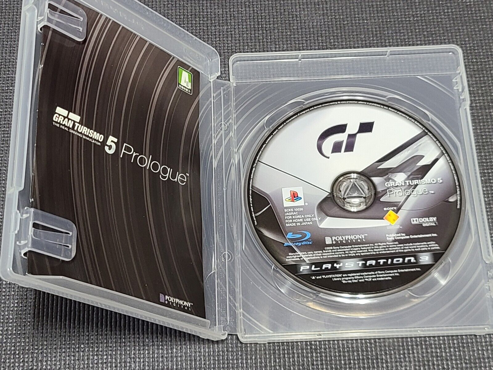
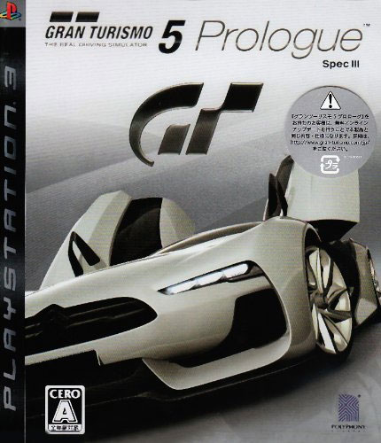

## GT5P Games Convention 2007 Build  (~Aug ??, 2007)

:material-shovel: *Dumped*: :x: {==No==}

??? youtube "Video"
    <iframe width="1180" height="664" src="https://www.youtube.com/embed/HKnUsyExB4Q" title="GC Gran Turismo 5 Prologue presentation part 1" frameborder="0" allow="accelerometer; autoplay; clipboard-write; encrypted-media; gyroscope; picture-in-picture; web-share" allowfullscreen></iframe>

---

## GT5P Tokyo Games Show 2007 Build (~Sep ??, 2007)

:material-shovel: *Dumped*: :x: {==No==}

??? youtube "Video"
    <iframe width="1180" height="664" src="https://www.youtube.com/embed/VBqMsB97-cQ" title="Gran Turismo 5 Prologue - Tokyo Game Show 2007 : DigInfo" frameborder="0" allow="accelerometer; autoplay; clipboard-write; encrypted-media; gyroscope; picture-in-picture; web-share" allowfullscreen></iframe>

---

## GT5P Tokyo Motor Show 2007 Build (~Oct ??, 2007)

:material-shovel: *Dumped*: :x: {==No==}

??? youtube "Video"
    <iframe width="885" height="664" src="https://www.youtube.com/embed/x5L9G3g7IEo" title="Tokyo Motor Show 2007 15/16 - Gran Turismo 5 Prologue on GTC" frameborder="0" allow="accelerometer; autoplay; clipboard-write; encrypted-media; gyroscope; picture-in-picture; web-share" allowfullscreen></iframe>

---

## GT5P Free Trial Version (October 20th, 2007)

{ width=250 }

:material-shovel: *Dumped*: {++Yes++} - available on [PSN](http://zeus.dl.playstation.net/cdn/JP9001/NPJA90061_00/9SOewVRkmHmJ3aUbsGtNkf8R8Jd5dMEnQinATnvNugIyeNcd6QM3m3FyhyIqJeWKICrSMXPEaTd0LAVCUqHoGYBvTyuiixLV5jp6i.pkg)

Japan only release. Game Code: `NPJA-90061`

??? note "Build Info"
    * Adhoc Version: `10`
    * Supports up to instruction: `48 - SYMBOL_CONST`
    * VersionBranch: `trial2007`
    * PDIVersion: `1.01`
    * SpecDB Version: `GT5_TRIAL2007_2730`
    * Volume Seed: `PDIPFS-071020-02`
    * Volume Key: **NONE** (Old PDIPFS Version)
    * KeyLicensee: `0xe55542933436efd7f22cf61b9c3940b1`
    * Grim URL: `https://gt5ptrial.ps3.online.jp.gran-turismo.com`
    * GT5P_TVBASEKEY: `z+GpfENhXfpTo/CJ9UjbgX0H9siurJ8PAe0/mm1MOBc=`
    * One executable `EBOOT.BIN`

??? note "Veiled Cars"
    Some car files were encrypted - waiting to be unveiled in real-life before being playable ingame. These files also had a custom [volume](../concepts/volume.md) flag that is tied to the [`MBufferDecryptManager`](https://nenkai.github.io/GTAdhocAPI/html/classpdiext_1_1_m_buffer_decrypt_manager.html) adhoc object.
    
    In order for the car files to be decrypted, the [Grim](../concepts/online/grim.md) server returned decryption keys on release day. These keys were stored in the save, and `MBufferDecryptManager.addKey()` would be called, making these files available.

    If an unlocked game save wasn't backed up from back in the day, these files would've been permanently inaccessible.

    ##### Nissan GT-R '07
    * `car/lod/00030131` -> `SoyoGvyMYKCCjcYBCI8rY3GMy9eQlvy3KpEfuL2qZE4oAo5c`
    * `car/menu/00030131` -> `SoyoGvyMYKCCjcYBCI8rY3GMy9eQlvy3KpEfuL2qZE6GuajW`
    * `car/interior/00030131` -> `SoyoGvyMYKCCjcYBCI8rY3GMy9eQlvy3KpEfuL2qZE5JUizQ`
    * `car/meter/00030131` -> `SoyoGvyMYKCCjcYBCI8rY3GMy9eQlvy3KpEfuL2qZE5iDFjf`
    * `piece/car_thumb_M/gtr_07_01.img` -> `cjg1NDJzZDVmNGgyNXM0cnQ2eTJkcjg0Z3pkZmJ3ZmEtdwwS`

    ##### Subaru Impreza WRX STI '07
    * `car/lod/00200032` -> `KeaQvtvmSURh566l5+kUB1DmtHtv8OVbCesIXJ0ETPI1QYGR`
    * `car/menu/00200032` -> `KeaQvtvmSURh566l5+kUB1DmtHtv8OVbCesIXJ0ETPJS5l7P`
    * `car/interior/00200032` -> `KeaQvtvmSURh566l5+kUB1DmtHtv8OVbCesIXJ0ETPKP9PTn`
    * `piece/car_thumb_M/impreza_wrx_sti_07_03.img` -> `cTM0NWgzNTZ5djJoZzRmMTIzNDQ1NjQ1ajZqMjRoNWY4Rqik`

---

## GT5P JP (December 1st, 2007)

{ width="250" }

:material-shovel: *Dumped*: {++Yes++} - available on archive (playstation 3 - redump collection - needs ird decryption) · :material-disc: [Redump Info](http://redump.org/disc/34549/)

Game Code: `BCJS-30017`

??? note "Build Info"
    * Adhoc Version: `10`
    * Supports up to instruction: `48 - SYMBOL_CONST`
    * VersionBranch: `gt5p`
    * VersionTarget: `ps3`
    * VersionEnvironment: `product-common-key`
    * VersionBuild: `release`
    * VersionUser: `build`
    * VersionApplication: `gt`
    * PDIVersion: `1.03`
    * SpecDB Version: `GT5_PROLOGUE2813`
    * CompileDateTime: `2007/12/01 01:17:48`
    * CompileVMKVersion: `gt.gt5p.jp.ps3.product-common-key.release.build`
    * CompileSVNRevision: `26426`
    * Volume Seed: `PDIPFS-071201-11`
    * Volume Key: `79764919, 79764919, 79764919, 79764919`
    * Volume Serial: `218164878`
    * KeyLicensee: `0xdfaae1a969af32b72a87e3e53e0f7737`
    * Grim URL: `https://gt5prologue.ps3.online.jp.gran-turismo.com`
    * GT5P_TVBASEKEY: `z+GpfENhXfpTo/CJ9UjbgX0H9siurJ8PAe0/mm1MOBc=`
    * Split executables (EBOOT + EMAIN)
    * `TV.DAT` (museum images + movies + XML + movie img files + strobes)

---

## GT5P EU Spec II (March 3rd, 2008)

{ width="250" }

:material-shovel: *Dumped*: {++Yes++} - available on archive (playstation 3 - redump collection - ird must be generated from redump metadata) · :material-disc: [Redump Info](http://redump.org/disc/29340/)

Game Code: `BCES-00104`

??? note "Build Info"
    * Adhoc Version: `?`
    * Supports up to instruction: `48 - SYMBOL_CONST`
    * VersionBranch: `gt5p`
    * VersionTarget: `ps3`
    * VersionEnvironment: `product-common-key`
    * VersionBuild: `release`
    * VersionUser: `build`
    * VersionApplication: `gt`
    * ProductVersion: `1.00`
    * PDIVersion: `1.00`
    * SpecDB Version: `GT5_PROLOGUE2813`
    * CompileDateTime: `2008/03/03 23:16:01`
    * CompileVMKVersion: `gt.gt5p.uk.ps3.product-common-key.release.build`
    * CompileSVNRevision: `27796`
    * Volume Seed: `TOTTORI-56231425`
    * Volume Key: `1596565275,2819179983, 3201083215, 130646031`
    * KeyLicensee: `0x369f23564f6c0cc892c030c061a131f1`
    * GrimURL: `https://gt5prologue.ps3.online.us.gran-turismo.com`
    * GT5P_TVBASEKEY: `z+GpfENhXfpTo/CJ9UjbgX0H9siurJ8PAe0/mm1MOBc=`
    * Split executables (EBOOT + EMAIN)

---

## GT5P US Spec II (PSN) (March 22th, 2008)

{ width="300" }

:material-shovel: *Dumped*: {++Yes++} - available on [PSN](http://zeus.dl.playstation.net/cdn/UP9000/NPUA80075_00/JvlRY2aTWbYYacobdJMWmuu4lYAWnV9e8KiWV9gLIG8fBiSd8LWqNRL1mGRD83qnOPOmhiSg05IdWNhYJorG7dJLi5R1kyE7jwW2R.pkg)

Game Code: `NPUA-80075`

??? note "Build Info"
    * Adhoc Version: `?`
    * Supports up to instruction: `48 - SYMBOL_CONST`
    * VersionBranch: `gt5p`
    * VersionTarget: `ps3`
    * VersionEnvironment: `product-common-key`
    * VersionBuild: `release`
    * VersionUser: `build`
    * VersionApplication: `gt`
    * ProductVersion: `1.00`
    * PDIVersion: `1.00`
    * SpecDB Version: `GT5_PROLOGUE2813`
    * CompileDateTime: `9/26/2008 17:13:58`
    * CompileVMKVersion: `gt.gt5p.jp.ps3.product-common-key`
    * CompileSVNRevision: `28055`
    * Volume Seed: `SONORA-550937027`
    * Volume Key: `1258979325, 3441419117, 1347072437, 910825263`
    * KeyLicensee: `0xc7400aa3ba633e223a5cb94f7af25ffb`
    * GrimURL: `https://gt5prologue.ps3.online.us.gran-turismo.com`
    * GT5P_TVBASEKEY: `z+GpfENhXfpTo/CJ9UjbgX0H9siurJ8PAe0/mm1MOBc=`
    * Split executables (EBOOT + EMAIN)

---

## GT5P Spec II (Korea) (May 19th, 2008)

{ width="250" }

:material-shovel: *Dumped*: {++Yes++} - available on archive (playstation 3 - redump collection - ird must be generated from redump metadata) · :material-disc: [Redump Info](http://redump.org/disc/101556/)

Game Code: `BCKS-10030` (based on NPHA-80045)

??? abstract "File List"
    * [Disc + GT.VOL](file_lists/BCKS10030_disc.txt)
    * [Game Dir](file_lists/BCKS10030_install.txt)

??? note "Build Info"
    * Adhoc Version: `11`
    * Supports up to instruction: `57 - ASSIGN_POP`
    * VersionBranch: `gt5p`
    * VersionTarget: `ps3`
    * VersionEnvironment: `product-common-key`
    * VersionBuild: `release`
    * VersionUser: `build`
    * VersionApplication: `gt`
    * PDIVersion: `1.00`
    * SpecDB Version: `GT5_PROLOGUE2813`
    * CompileDateTime: `2008/05/19 19:56:34`
    * CompileVMKVersion: `gt.gt5p.jp.ps3.product-common-key.release.build`
    * CompileSVNRevision: `28405`
    * Volume Seed: `CHONSANDO-565545051`
    * Volume Key: `3609930371, 3569941981, 60292733, 396373479`
    * Volume Serial: `232919852`
    * KeyLicensee: `0xdde755fedc0727e5cc055e3c502f5a38`
    * Grim URL: `https://gt5prologue.ps3.online.kr.gran-turismo.com`
    * GT5P_TVBASEKEY: `z+GpfENhXfpTo/CJ9UjbgX0H9siurJ8PAe0/mm1MOBc=`
    * Split executables (EBOOT + EMAIN)
    * `TV.DAT` (movies + XML + strobes + Pace DLS)

??? tip "Grim Files"
    Build contains the following file types:

    * Pace DLS
    * Movie Strobe
    * Movies XMLs
    * Movies PAM

    Decryption of Grim files using GTToolsSharp:
    ```
    crypt -g GT5P_KR -i grim\file\contents\tv_8_465539187.dls --keyset-seed-override BCKS-10030 --alternative
    ```

??? note "Video Keys"
    Decrypt the grim files individually first, then use `cryptmovie` with the keys below
    * tv_8_280528187.pam key: `IgCub2PBagBN7bi5SxsXXbvWWBvOejk1/Ng+qVWTArY=` (デイトナ・インターナショナル・スピードウェイ)
    * tv_9_759604186.pam key: `VD7GwRdpX1HzTHIq1gx3OzFJNgQwbx+BlKIpWs1CQ7I=` (アイガー北壁コース)
    * tv_10_759604186.pam key: `nEhnJFlE/Mablm/yMvjqSabq3+BGyglN86LSCvyikt4=` (富士スピードウェイ)
    * tv_11_436743641.pam key: `OgfReEOdx3idSCHMYZ5w1tJuuLLWnwcq/DDMzp+CflE=` (ロンドン市街地コース)
    * tv_12_957666642.pam key: `56dtpix1GqgJKWBVHZHw+4pLTDGIWC0AtlZgcxAYUmA=` (鈴鹿サーキット)
    * tv_46_494248732.pam key: `CMQO4V1Gj+eUxqMJN0RNCe7DySAeiNA5I2CJ9ShOXPI=` (OPENING)
    * tv_63_494248732.pam key: `at03Qoe8C3KYJfLetWnzy7bdqG10T8XwNzWyvsyUkjU=` (ENDING)

---

## GT5P Spec II Nürburgring Special Edition 2008  (~May ??, 2008)

:material-shovel: *Dumped*: :x: {==No==}

??? youtube "Video"
    <iframe width="885" height="664" src="https://www.youtube.com/embed/4suUwTrVfcs" title="GT5P - Nordschleife" frameborder="0" allow="accelerometer; autoplay; clipboard-write; encrypted-media; gyroscope; picture-in-picture; web-share" allowfullscreen></iframe>

---


## GT5P Games Convention 2008 Build (~Aug ??, 2008)

:material-shovel: *Dumped*: :x: {==No==}

??? youtube "Video"
    <iframe width="885" height="664" src="https://www.youtube.com/embed/62ZZu4UAKE4" title="Gran Turismo 5 - Leipzig Game Convention" frameborder="0" allow="accelerometer; autoplay; clipboard-write; encrypted-media; gyroscope; picture-in-picture; web-share" allowfullscreen></iframe>

---

## GT5P Special Event Version GT by Citroën (October 11th, 2008)

{ width="250" }

:material-shovel: *Dumped*: {++Yes++} - available on [archive](https://archive.org/details/GranTurismo5PrologueEuropeDemoSpecialEventVersionGTByCitron) · :material-disc: [Redump Info](http://redump.org/disc/59988/)

Game Code: `BCED-00393` / `PKJM00393`

??? note "Build Info"
    * Adhoc Version: `12`
    * Supports up to instruction: `60 - DOUBLE_CONST`
    * VersionBranch: `citroen`
    * VersionTarget: `ps3`
    * VersionEnvironment: `product-common-key`
    * VersionBuild: `release`
    * VersionUser: `build`
    * VersionApplication: `gt`
    * ProductVersion: `1.00`
    * PDIVersion: `0.10`
    * SpecDB Version: `GT5_PROLOGUE2813`
    * CompileDateTime: `2008/09/11 15:14:21`
    * CompileVMKVersion: `gt.citroen.uk.ps3.product-common-key.release.build`
    * CompileSVNRevision: `29533`
    * Volume Seed: `KARAKUM-176730298`
    * Volume Key: `2572490225, 3350870255, 2843966437, 1623495263`
    * KeyLicensee: `0x550bea788734e91e0128cd59755c5753`
    * Grim URL: `https://gt5p-citroen.ps3.online.uk.gran-turismo.com`
    * GT5P_TVBASEKEY: `z+GpfENhXfpTo/CJ9UjbgX0H9siurJ8PAe0/mm1MOBc=`
    * Split executables (EBOOT + EMAIN)
    * `TV.DAT` (only XML + img files)

??? note "Video Keys"
    * 163.pam key: `MB48bmS6rUgvjjM0795qgdk9cIwJppYdBwGIGowWDts=`

---

## GT5P EU Spec III (PSN) (October 26th, 2008)

{ width="300" }

:material-shovel: *Dumped*: {++Yes and No++} - RAP is missing. Keys to volume are known.

Game Code: `NPUA-00050`

??? note "Build Info"
    * Adhoc Version: `12`
    * Supports up to instruction: `60 - DOUBLE_CONST`
    * VersionBranch: `gt5p`
    * VersionTarget: `ps3`
    * VersionEnvironment: `product-common-key`
    * VersionBuild: `release`
    * VersionUser: `build`
    * VersionApplication: `gt`
    * ProductVersion: `3.00`
    * PDIVersion: `3.00`
    * SpecDB Version: `GT5_PROLOGUE2813`
    * CompileDateTime: `9/26/2008 17:13:58`
    * CompileVMKVersion: `gt.gt5p.jp.ps3.product-common-key`
    * CompileSVNRevision: `29712`
    * Volume Seed: `TOTTORI-56231425`
    * Volume Key: `1596565275,2819179983, 3201083215, 130646031`
    * KeyLicensee: `0xdfaae1a969af32b72a87e3e53e0f7737`
    * GT5P_TVBASEKEY: `z+GpfENhXfpTo/CJ9UjbgX0H9siurJ8PAe0/mm1MOBc=`
    * Split executables (EBOOT + EMAIN)

??? tip "Grim Files"
    Build contains the following file types:

    * Pace DLS
    * Movie Strobe
    * Movies XMLs

    Decryption of Grim files using GTToolsSharp:
    ```
    crypt -g GT5P_DISC_EU -i grim\file\tv_de_15.xml --keyset-seed-override BCES-00104 --alternative
    ```

??? note "Video Keys"
    * tv_8_280528187.pam key: `IgCub2PBagBN7bi5SxsXXbvWWBvOejk1/Ng+qVWTArY=` (デイトナ・インターナショナル・スピードウェイ)
    * tv_9_759604186.pam key: `VD7GwRdpX1HzTHIq1gx3OzFJNgQwbx+BlKIpWs1CQ7I=` (アイガー北壁コース)
    * tv_10_759604186.pam key: `nEhnJFlE/Mablm/yMvjqSabq3+BGyglN86LSCvyikt4=` (富士スピードウェイ)
    * tv_11_436743641.pam key: `OgfReEOdx3idSCHMYZ5w1tJuuLLWnwcq/DDMzp+CflE=` (ロンドン市街地コース)
    * tv_12_957666642.pam key: `56dtpix1GqgJKWBVHZHw+4pLTDGIWC0AtlZgcxAYUmA=` (鈴鹿サーキット)
    * tv_13_xxx.pam key: `4PVDlQImtNlNAbGfaEWJYn5/YQBoVKYiSX8iLE1dKD8=` (OPENING)
    * tv_14_xxx.pam key: `a6sDVkOLo+xPX71VSeku35F6m6MiqpMTodlqzvqNGkI=` (ENDING)
    * tv_32_xxx.pam key: `EevbVEbmwYm64WxY8G6i1nPZzmzs5H1BZ5X9VHxudLk=` (ENDING)
    * tv_42_xxx.pam key: `O+Cx9Fqbt1jIN7CVrxwxhV+CqsD2WS6/81pFV66vdh4=` (LANCER EVOLUTION X)
    * tv_43_xxx.pam key: `iRIuNn1giN0DXa4kqTWMY8YkC/yJ6l+rPF07BTzoIFE=` (THE GT-R Legend INSIDE STORY I)
    * tv_44_xxx.pam key: `O9ChMgcHR93CUY8KvVNAR9G72ke0lUx6tbkafB0b5cM=` (THE GT-R Legend INSIDE STORY II)
    * tv_45_xxx.pam key: `DmzOkf87roubdE9Tk6TCvs2WOvuWZp/Abj/uHKPNujQ=` (THE GT-R Legend INSIDE STORY III)
    * tv_46_494248732.pam key: `CMQO4V1Gj+eUxqMJN0RNCe7DySAeiNA5I2CJ9ShOXPI=` (OPENING)
    * tv_47_xxx.pam key: `qfN/Yvw7tOYkdbkW+nVoCEP49641YSET/zPMo5mX6TU=` (ENDING)

---

## GT5P JP Spec III (November 1st, 2008)

{ width="250" }

:material-shovel: *Dumped*: {++Yes++} - available on archive (playstation 3 - redump collection) · :material-disc: [Redump Info](http://redump.org/disc/34549/)

Game Code: `BCJS-30017`

??? note "Build Info"
    * Adhoc Version: `12`
    * Supports up to instruction: `60 - DOUBLE_CONST`
    * VersionBranch: `gt5p`
    * VersionTarget: `ps3`
    * VersionEnvironment: `product-common-key`
    * VersionBuild: `release`
    * VersionUser: `build`
    * VersionApplication: `gt`
    * ProductVersion: `3.00`
    * PDIVersion: `3.00`
    * SpecDB Version: `GT5_PROLOGUE2813`
    * CompileDateTime: `2008/10/01 16:40:03`
    * CompileVMKVersion: `gt.gt5p.jp.ps3.product-common-key`
    * CompileSVNRevision: `29768`
    * Volume Seed: `PDIPFS-071201-11`
    * Volume Key: `79764919, 79764919, 79764919, 79764919`
    * KeyLicensee: `0xdfaae1a969af32b72a87e3e53e0f7737`
    * Grim URL: `https://gt5prologue.ps3.online.jp.gran-turismo.com`
    * GT5P_TVBASEKEY: `z+GpfENhXfpTo/CJ9UjbgX0H9siurJ8PAe0/mm1MOBc=`
    * Split executables (EBOOT + EMAIN + ESP)
    * `TV.DAT` (museum images + movies + XML + movie img files)

??? note "Video Keys"
    * tv_8_280528187.pam key: `IgCub2PBagBN7bi5SxsXXbvWWBvOejk1/Ng+qVWTArY=` (デイトナ・インターナショナル・スピードウェイ)
    * tv_9_759604186.pam key: `VD7GwRdpX1HzTHIq1gx3OzFJNgQwbx+BlKIpWs1CQ7I=` (アイガー北壁コース)
    * tv_10_759604186.pam key: `nEhnJFlE/Mablm/yMvjqSabq3+BGyglN86LSCvyikt4=` (富士スピードウェイ)
    * tv_11_436743641.pam key: `OgfReEOdx3idSCHMYZ5w1tJuuLLWnwcq/DDMzp+CflE=` (ロンドン市街地コース)
    * tv_12_957666642.pam key: `56dtpix1GqgJKWBVHZHw+4pLTDGIWC0AtlZgcxAYUmA=` (鈴鹿サーキット)
    * tv_14_999513644.pam key: `a6sDVkOLo+xPX71VSeku35F6m6MiqpMTodlqzvqNGkI=` (「GT5 プロローグ」エンディング)
    * tv_15_520437645.pam key: `3KegYN94Qfb0ialUYNf/Q1xTMAgMXaWfwADz4mEAVCo=` (The GT-R Legend Inside Story I)
    * tv_113_485895642.pam key: `zVxc6HuHt/MHU4LeM3+pZckok1eF8c9s3TDtuZF32VM=` (Long 1)
    * tv_176_016350468.pam key: `GUNgC5hkpwgPkyiLJRpp10bxieOkCKJMlYgThxosXio=` (「GT5 プロローグ」オープニング)

---

## GT5P DOME S102 '08 Build (?? ??, 2008)

:material-shovel: *Dumped*: :x: {==No==}

??? youtube "Video"
    <iframe width="786" height="664" src="https://www.youtube.com/embed/5zcrgrLQ72I" title="Circuit de La Sarthe in GT5P" frameborder="0" allow="accelerometer; autoplay; clipboard-write; encrypted-media; gyroscope; picture-in-picture; web-share" allowfullscreen></iframe>

---

## GT5P Le Mans Special Edition (~Jun ??, 2009)

:material-shovel: *Dumped*: :x: {==No==}

??? youtube "Video"
    <iframe width="885" height="664" src="https://www.youtube.com/embed/mC5sFD8aT58" title="Gran Turismo 5 : Prologue - Special Events Version" frameborder="0" allow="accelerometer; autoplay; clipboard-write; encrypted-media; gyroscope; picture-in-picture; web-share" allowfullscreen></iframe>

---