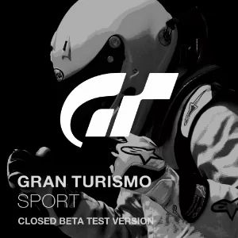

## GT Sport - E3 2016 Build  (~Jun ??, 2016)

:material-shovel: *Dumped*: :x: {==No==}

??? youtube "Videos"
    <iframe width="1180" height="664" src="https://www.youtube.com/embed/54rL6JbWSqY" title="Gran Turismo Sport : E3 2016 Gameplay Capture Video - 1080p/60fps" frameborder="0" allow="accelerometer; autoplay; clipboard-write; encrypted-media; gyroscope; picture-in-picture; web-share" allowfullscreen></iframe>
    <iframe width="1180" height="664" src="https://www.youtube.com/embed/7Fc5sGpivWM" title="Gran Turismo Sport PS4 E3 Gameplay Frame-Rate Test" frameborder="0" allow="accelerometer; autoplay; clipboard-write; encrypted-media; gyroscope; picture-in-picture; web-share" allowfullscreen></iframe>
    
---

## GT Sport - Gamescom 2016 Build (~Aug ??, 2016)

:material-shovel: *Dumped*: :x: {==No==}

??? youtube "Video"
    <iframe width="1180" height="664" src="https://www.youtube.com/embed/INhSoXpoJ14" title="Gamescom 2016 Gameplay Gran Turismo Sport" frameborder="0" allow="accelerometer; autoplay; clipboard-write; encrypted-media; gyroscope; picture-in-picture; web-share" allowfullscreen></iframe>

---

## GT Sport - Essen Motorshow Demo (November ??, 2016)

:material-shovel: *Dumped*: :x: {==No==}

??? youtube "Video by [Paiky/GT Archive](https://www.youtube.com/@GTArchivePaiky)"
    <iframe width="1280" height="720" src="https://www.youtube.com/embed/Ve2-vWX7hCA" title="Essen Motorshow 2016 GT Sport GamePlay" frameborder="0" allow="accelerometer; autoplay; clipboard-write; encrypted-media; gyroscope; picture-in-picture; web-share" allowfullscreen></iframe>

---

## GT Sport - Closed Beta Test Version

{ width="200" }

:material-shovel: *Dumped*: {==Barely==} - available on [archive](https://archive.org/details/CUSA07836-gt7sp-cb-1.08) - dumped by [Paiky/GT Archive](https://www.youtube.com/@GTArchivePaiky) - Only Europe 1.04 & 1.08

Closest build to GT6. Some leftover [TinyWeb](../concepts/adhoc/tinyweb.md) adhoc source scripts along with their compiled source are present in the `scripts/WWW/` folder.

* Europe: [`CUSA-07836`](https://orbispatches.com/CUSA07836)
* America: [`CUSA-03643`](https://orbispatches.com/CUSA03643)
* Asia: [`CUSA-03666`](https://orbispatches.com/CUSA03666)
* Japan: [`CUSA-03639`](https://orbispatches.com/CUSA03639)

??? abstract "File List"
    * CUSA-07836 1.08 - [PKG + VOL](file_lists/CUSA-07836/1_08.txt)

??? note "Build Info"
    * Adhoc Version: `12`
    * Supports FSRoot with `fsroot` argument
    * Last instruction supported: `71 - LOGICAL_OPTIONAL`
    * BuildID: `525_988daa0a2a13ccb8b7e93f332fd7f2253119fda9`
    * VersionBranch: `beta`
    * VersionEnvironment: `product`
    * VersionBuild: `release`
    * VersionUser: `build`
    * BuildMode: `default`
    * VersionApplication: `gt`
    * ApplicationVersion: `1.08`
    * RuntimePlatform: `ps4`
    * GrimURL: `https://gt7spb1.ps4.online.gran-turismo.com`
    * GrimSslCommonName: `gt7sp.ps4.online.gran-turismo.com`
    * Volume Seed: `KYZYLKUM-873068469`
    * Volume Key: `79764919, 79764919, 79764919, 79764919`
    * Volume Serial: `520894605` (`04/07/2017 20:56:45`)
    * CompileDateTime (1.08 EU): `2017/07/04 20:56:31`
    * CompileVMKVersion: `gt.beta.ps4.product.release.build`
    * sceSNDX Library build date: `May  2 2017 19:30:01`

---
## GT Sport - Open Beta

{ width="200" }

:material-shovel: *Dumped*: {==Yes==} - available on [archive](https://archive.org/details/gtsport-beta-cusa10190) - Only the US version 

* America: `CUSA-10190`

??? note "Build Info"
    * Adhoc Version: `12`
    * Last instruction supported: `71 - LOGICAL_OPTIONAL`
    * VersionBranch: `beta`
    * VersionEnvironment: `product`
    * VersionBuild: `release`
    * VersionUser: `build`
    * BuildMode: `default`
    * VersionApplication: `gt`
    * ApplicationVersion: `1.00`
    * RuntimePlatform: `ps4`
    * GrimURL: `https://gt7spb2.ps4.online.gran-turismo.com`
    * GrimSslCommonName: `gt7sp.ps4.online.gran-turismo.com`
    * Volume Seed: `KYZYLKUM-873068469`
    * Volume Key: `79764919, 79764919, 79764919, 79764919`
    * CompileDateTime: `2017/10/02 03:43:18`
    * CompileVMKVersion: `gt.beta.ps4.product.releaseL.build`

---

## GT Sport - MEGAWEB GR ZONE (~Sep ??, 2017)

:material-shovel: *Dumped*: :x: {==No==}

??? youtube "Video"
    <iframe width="1280" height="720" src="https://www.youtube.com/embed/KRKblnEEeVQ" title="MEGAWEB GR ZONE GT SPORT + Thrustmaster T-GT  GT86 FreePlay" frameborder="0" allow="accelerometer; autoplay; clipboard-write; encrypted-media; gyroscope; picture-in-picture; web-share" allowfullscreen></iframe>

---

## GT Sport (October 17, 2017)

{ width="200" }

:material-shovel: *Dumped*: {==Yes==}

* Europe: [`CUSA-02168`](https://orbispatches.com/CUSA02168)
* America: [`CUSA-03220`](https://orbispatches.com/CUSA03220)
* Asia: [`CUSA-03667`](https://orbispatches.com/CUSA03667)
* Japan: ?

??? note "Build Info"
    * Adhoc Version: `12`
    * Last instruction supported: `71 - LOGICAL_OPTIONAL`
    * BuildID: `367_69dbafe711c53964f18661ccd43a9dc3ce06d025`
    * VersionBranch: `gt7sp`
    * VersionEnvironment: `product`
    * VersionBuild: `release`
    * VersionUser: `build`
    * BuildMode: `default`
    * VersionApplication: `gt`
    * ApplicationVersion: `1.00`
    * RuntimePlatform: `ps4`
    * GrimURL: `https://gt7sp.ps4.online.gran-turismo.com`
    * GrimSslCommonName: `gt7sp.ps4.online.gran-turismo.com`
    * Volume Seed: `KYZYLKUM-873068469`
    * Volume Key: `3386540197, 84781473, 2662465125, 3058823931`

---

## GT Sport - TGS2017 VR Support (~Nov ??, 2017)

:material-shovel: *Dumped*: :x: {==No==}

??? youtube "Video"
    <iframe width="1280" height="720" src="https://www.youtube.com/embed/0xUQZqoUVXw" title="TGS2017  GT SPORT + Thrustmaster T-GT + PlayStation VR" frameborder="0" allow="accelerometer; autoplay; clipboard-write; encrypted-media; gyroscope; picture-in-picture; web-share" allowfullscreen></iframe>