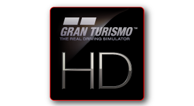
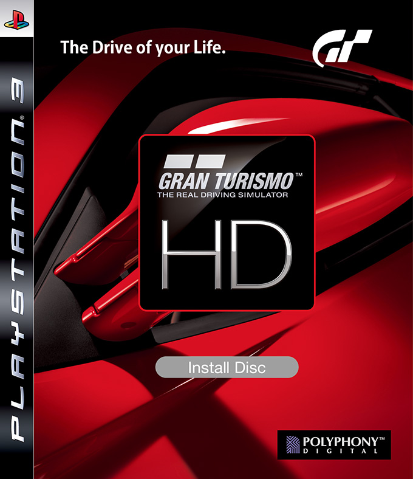

Gran Turismo HD was supposed to be a remastered, high-definition of GT4 for the PS3. Unfortunately it never came to be, except for a demo.

Most of it still uses GT4 formats.

## GT HD E3 2006 Build (~May ??, 2006)

:material-shovel: *Dumped*: :x: {==No==}

??? youtube "Video"
    <iframe width="1180" height="664" src="https://www.youtube.com/embed/8sEOxW2Ywec" title="Gran Turismo HD E3 2006 - Bike Gameplay 2 - Tokyo R246" frameborder="0" allow="accelerometer; autoplay; clipboard-write; encrypted-media; gyroscope; picture-in-picture; web-share" allowfullscreen></iframe>

---

## GT HD Tokyo Game Show 2006 Build (~Sep ??, 2006)

:material-shovel: *Dumped*: :x: {==No==}

??? youtube "Video"
    <iframe width="1173" height="664" src="https://www.youtube.com/embed/ekM-PC50eTw" title="Gran Turismo HD - Early Eiger - Lancer Evo  (offscreen video)" frameborder="0" allow="accelerometer; autoplay; clipboard-write; encrypted-media; gyroscope; picture-in-picture; web-share" allowfullscreen></iframe>

---

## GT HD Premium Subaru Impreza Rally Car '99 Build (?? ??, 2006)

:material-shovel: *Dumped*: :x: {==No==}

??? youtube "Video"
    <iframe width="1180" height="664" src="https://www.youtube.com/embed/EmtcQGOJyUc" title="Gran Turismo HD Beta Premium Subaru Impreza Rally Car &#39;99 - Early Demo Replay" frameborder="0" allow="accelerometer; autoplay; clipboard-write; encrypted-media; gyroscope; picture-in-picture; web-share" allowfullscreen></iframe>

---

## GT HD Nissan Xanavi Nismo Z Build (?? ??, 200?)

:material-shovel: *Dumped*: :x: {==No==}

??? youtube "Video"
    <iframe width="1180" height="664" src="https://www.youtube.com/embed/cnTBaKQmoQg" title="GTHD Nissan Xanavi Nismo Z" frameborder="0" allow="accelerometer; autoplay; clipboard-write; encrypted-media; gyroscope; picture-in-picture; web-share" allowfullscreen></iframe>

---

## GT HD "Wedding Version" (?? ??, 200?)

:material-shovel: *Dumped*: :x: {==No==}

Most likely never released to the public. 

??? note "Tweet"
    <blockquote class="twitter-tweet" data-theme="dark">
思い出に残るであろう一昨日の誕生日に続き、本日は15年目の結婚記念日。  皆様のおかげで無事15年幸せに過ごしております。  披露宴パーティーはスイスのクライネシャイデックでした。(Granturismo Wedding Ver.を含め、会社の皆さんには色々と用意していただきました)懐かしい。 <a href="https://t.co/vFe0oKIB6t">pic.twitter.com/vFe0oKIB6t</a>
&mdash; Akira Saito (@a_saito) <a href="https://twitter.com/a_saito/status/1494257075580727298?ref_src=twsrc%5Etfw">February 17, 2022</a></blockquote> 

---

## GT HD Concept (PSN)

{ width="200" }

:material-shovel: *Dumped*: {++Yes++}

* JP Game Code: `NPJA-00010` [2.0?](http://zeus.dl.playstation.net/cdn/JP9000/NPJA00010_00/Sq22iX7YGBLneIAxq175xDnyrx2efId9qbGtJHuP1yWSs9Q2lJHi8yGq9dPNvaykpXyaCqvF7vsMFjtFQ8t7S67nGToa2kwigQeKH.pkg)
* EU Game Code: `NPEA-90002` [2.0?](http://zeus.dl.playstation.net/cdn/EP9000/NPEA90002_00/jwx3AOv0gH0Gj2QLdMBVDQTUovfEEXq0Dc7dOIOAtkre5WUES9twg0NIvUpmdprwjXee0KqkeTk6M8p4I1cVEWIXJDhkOlfIsI7RJ.pkg)
* ASIA Game Code: `NPHA-00001` [1.0](http://zeus.dl.playstation.net/cdn/HP9000/NPHA00001_00/dunbdpoU2rdfnOb9UGDfGixxV7heXBFEfQwwMFwMHMwGFBMpXoW7lDUYwpr8eFDoRvq8BcaB7JVypkUCs4Yc4fHOWehTBN46VwX36.pkg)
* US Game Code: `NPUA-80019` [1.1](http://zeus.dl.playstation.net/cdn/UP9000/NPUA80019_00/EljUuXoMkboma8lQgJydRRBlCKJv4kSE7bNH5wImyvTlIUXnfe8A41AXR08NsoyxDSWwRhWfjamnqBLKYWDOmrdFiK4mICtaPRUVv.pkg) - [1.2](http://ares.dl.playstation.net/cdn/UP9000/NPUA80019_00/6eswGLr8L7re4iye4yd8ycdqodyPtY7jj8dVjYaXvrb5Mqr1Srx87uLIYtqnuAWpx2mxOFWYrDjUj42FXw1SWnCjHqMKvAoevm0Ky.pkg)

??? note "Build Info"
    * Adhoc Version: `10`
    * ModelSet3 Version: `0`
    * Config: `trial`
    * Supports up to instruction: `46 - CALL_OLD`
    * BuildNumber: `22`
    * PDIVersion: `1.16`
    * Game Code: `SCUS-97384`
    * Compile Time: `Mar 22nd, 2007` (US 1.2)
    * SpecDB Version: `GT5_TRIAL_(EU/US/..)2704`
    * Uses V3.1 [Volume](../concepts/volume.md) TOC (GT4-type volume)
    * Unified executable

---

## GT HD Concept (JP Disc)

{ width="200" }

:material-shovel: *Dumped*: {++Yes++} - available on archive (redump collection) · :material-disc: [Redump Info](http://redump.org/disc/56219/)

This disc installs `NPJA00010`.

---

## Gran Turismo HD Audi-Shell/Le Mans 2007 Demo (June 11, 2007)

{ width="200" }
{ width="200" }

:material-shovel: *Dumped*: {++Yes++} - [available on archive](https://archive.org/details/gthd-concept-audi-pdev00400)

Game Code: `PDEV-00400`

A build of Gran Turismo HD Concept demoed during Le Mans 2007 featuring two cars: the Audi R8 '07 and the Audi TT Coupe 3.2 quattro '07, aswell as two tracks: Circuit de la Sarthe and Eiger Short. [News Article](https://web.archive.org/web/20071213132030/http://www.gran-turismo.com/jp/news/d823.html)

It presumably was the result of a partnership with Shell, as the logo is also displayed in-game. This build is the last one that resembles and uses the GT4/GTHD UIs as the GT5P Free Trial Version was released to the public 4 months later. 

This build is heavily based on the retail version of GTHD, but strays further away from GT4 as a whole. For instance, the `script` folder has been renamed to `scripts` and `scripts/gt5` is now in use.

Internally, no other cars are present. Courses contain `c042` (`r_eiger_short`), `c049` (`sarthe2005_old`) and interestingly, `c056`, which would later on become `sarthe2009` in GT5.

Some odd `keylog` files are also present in the `projects/trial/trial` folder, never seen in any other builds, not files actually used by the game.

The build was recovered off a DECHA00A by sneakersdiep. Nothing else was installed on the hard drive, leading to the assumption that this devkit was only used for this very event.

??? youtube "Video (during live-event)"
    <iframe width="1280" height="712" src="https://www.youtube.com/embed/RDXhoPGWXgI" title="gt hd le mans" frameborder="0" allow="accelerometer; autoplay; clipboard-write; encrypted-media; gyroscope; picture-in-picture; web-share" allowfullscreen></iframe>

??? youtube "Video by [Paiky/GT Archive](https://www.youtube.com/@GTArchivePaiky)"
    <iframe width="1401" height="788" src="https://www.youtube.com/embed/2v9vKasHWAY" title="Gran Turismo HD Le Mans 2007 Demo | PDEV-00400 | Jun 11, 2007" frameborder="0" allow="accelerometer; autoplay; clipboard-write; encrypted-media; gyroscope; picture-in-picture; web-share" allowfullscreen></iframe>

??? abstract "File List"
    * [Install + VOL](file_lists/PDEV-00400-audi.txt)

??? abstract "Secret Commands"
    * Unlocking main menu options: Hold L1+R1+L2+R2 and press Right Right Left Left Right Right Left Left and then Start
    * Unlocking settings menu options: Hold L1+R1+L2+R2 and press Down Right Right Down Right Right Down Right Right and then Start

??? note "Build Info"
    * Adhoc Version: `10`
    * ModelSet3 Version: `0`
    * Branch/Config: `audi`
    * Supports up to instruction: `48 - SYMBOL_CONST`
    * PDIVersion: `undefined`
    * GetVersionString: `r0001`
    * GetMenuProductVersion: `trial`
    * GetScriptProductVersion: `gt5`
    * GetBuildNumber: `11`
    * GetContainmentVersion: `GT4`
    * Game Code: `PDEV-00400`
    * Compile Time: `June 11th, 2007` (Based on volume file dates), otherwise `June 3rd, 2007` based on `rt` library compile dates.
    * SpecDB Version: `GT5_LEMANS_07_2710`
    * Uses V3.1 [Volume](../concepts/volume.md) TOC (GT4-type volume)
    * One executable `EBOOT.BIN`