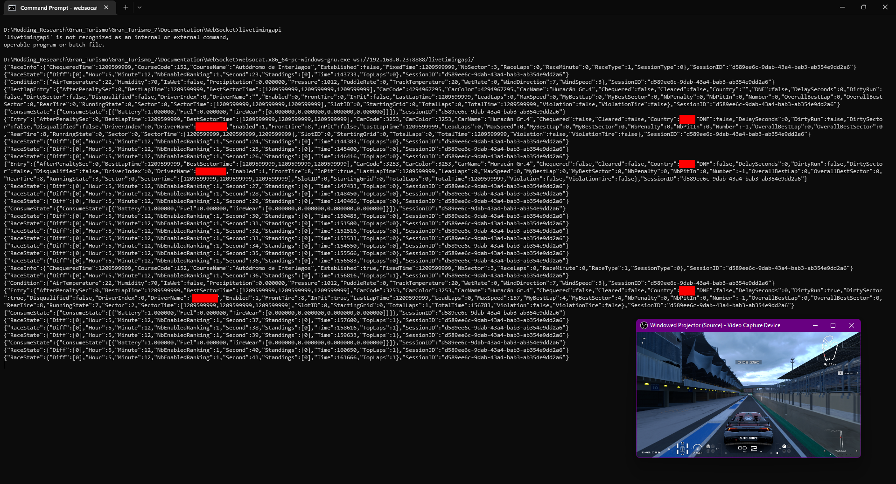

# TinyWeb

TinyWeb is an API for building web apps/services through adhoc, similar to [ASP.NET](https://asp.net) or [Django](https://www.djangoproject.com/). It is available since Gran Turismo 6, and is primarily used by PDI for live events (especially since GT Sport).

Here is an example of how GT7 exposes camera controls over TinyWeb:

<blockquote class="twitter-tweet" data-dnt="true" data-theme="dark"><p lang="en" dir="ltr">A small sample of how the live events are controlled from outside the game. This would be the camera/displaypart. <br>Quick camera jump to any car, and UI display control. <a href="https://t.co/fHkTmQBW1H">pic.twitter.com/fHkTmQBW1H</a></p>&mdash; Nenkai (@Nenkaai) <a href="https://twitter.com/Nenkaai/status/1574411826217062400?ref_src=twsrc%5Etfw">September 26, 2022</a></blockquote> <script async src="https://platform.twitter.com/widgets.js" charset="utf-8"></script>

## Requirements

The game must be running in QA mode (in GT7, live event permissions on the account also works). Once that is done, a certain game structure must be present:

```{ .sh .no-copy }
.
├─ car/
├─ carparts/
...
└─ www/              # This is the main TinyWeb folder
   └─ <branch_name>/ # i.e "gt6"
      ├─ adhoc/      # Contains adhoc web modules - In script form
      ├─ config/     # Important folder - it sets up how TinyWeb should be running.
      └─ html/       # Static html resources - .html/.css/.js etc.
...
```

## Configuration

A `server.conf` file is required in the `config` folder to setup TinyWeb:

!!! warning
    On a debug branch, `server-debug.conf` may be used instead.

??? example "Example file (click to expand)"

    ``` markdown title="server.conf"
    ###########################################################
    # Listen
    #
    # [PortNumber] - Port of which TinyWeb will listen to
    ###########################################################
    Listen 8080

    ###########################################################
    # Timeout
    #
    # [TimeoutSec] - Timeout before TinyWeb cancels a request
    ###########################################################
    Timeout 180

    ###########################################################
    # RequestThreadStackSize
    #
    # [StackSizeKB] - Adhoc request thread stack size
    ###########################################################
    RequestThreadStackSize 64

    ###########################################################
    # JobThreadStackSize
    #
    # [StackSizeKB] - TinyWeb job thread stack size
    ###########################################################
    JobThreadStackSize 64

    ###########################################################
    # FileModule
    # File modules allow accessing the game's or console's directories.
    # [MappingPath] [AbsoluteFilePath]
    ###########################################################

    # Root
    FileModule / /

    # /www/ will be mapped to /www/gt6/html/
    FileModule /www/ /www/gt6/html/

    # Aka USRDIR, encrypted
    FileModule /APP_DATA/ /APP_DATA

    # Aka USRDIR, decrypted
    FileModule /APP_DATA_RAW/ /APP_DATA_RAW

    # Aka dev_hdd1, encrypted
    FileModule /APP_CACHE/ /APP_CACHE

    # Aka dev_hdd1, decrypted
    FileModule /APP_CACHE_RAW/ /APP_CACHE_RAW

    # Memory Stick
    FileModule /APP_MS/ /APP_MS

    # USB Device
    FileModule /APP_USB/ /APP_USB

    FileModule /dlcontents/ /dlcontents

    # GT Sport & above only - you can forbid or allow certain endpoints from being accessed
    # Mostly used to forbid access to certain web module while running as regular TinyWeb as opposed to debug.
    Location /adhoc {
        deny all
    }

    Location /adhoc/live_event {
        allow all
    }
    ```

## Accessing TinyWeb

Once you meet the requirements, you can access TinyWeb from the IP:Port in any web browser of your liking. 

<figure markdown>
  { width="400" }
  <figcaption>If you have it successfully setup, you will see this "hello world!" screen</figcaption>
</figure>

!!! note
    If you are using RPCS3, make sure that Network :octicons-arrow-right-16: Network Status is set to `Connected`.

    If you are booting to the runviewer branch with the argument `branch=runviewer` (or any other way), you need to also supply `network_available=1` to access TinyWeb.

    Just incase it doesn't work, change the Listen port from `8080` to anything else i.e `12345`.


## Modules

Modules are extra services that TinyWeb can expose. You've already seen one, `FileModule`, which allows mapping and reflecting a directory to your browser.

Some more exist that can be activated through adhoc - here is the default that is enabled in GT6, for example

=== "Adhoc"

    ```cpp
    GTServiceManager.registerService(gtengine::ServiceType::SimulatorInterface); // Enables the Simulator Interface service
    ```
---

### AdminModule

:octicons-cpu-24: *Endpoint: `<host>/admin/`*

Allows setting logger settings (stripped in GT6), and seeing currently running modules. This is available by default.

{ width="300" }
{ width="300" }
{ width="200" height="500" }

---

### AdhocModule

:octicons-cpu-24: *Endpoint: `<host>/adhoc/`*

This is the most important module that TinyWeb exposes. It allows building your own modules based on adhoc which can return html content or serve as APIs themselves.

!!! tip
    It's the reason GT Sport and GT7 forbids access to that endpoint.

Web modules belongs to the `adhoc` folder. All the compiled scripts go there.

#### Accessing http request information
TinyWeb exposes custom variables that are accessible in Web Modules:

* `_SERVER` - Map representing current request/server information.
    * `_SERVER["HTTP_REFERER"]` - Returns the [Referer](https://developer.mozilla.org/en-US/docs/Web/HTTP/Headers/Referer) header.
    * `_SERVER["HTTP_USER_AGENT"]` - Returns the [User-Agent](https://developer.mozilla.org/en-US/docs/Web/HTTP/Headers/User-Agent) header.
    * `_SERVER["REMOTE_ADDR"]` - Returns the remote IP Address.
    * `_SERVER["REQUEST_METHOD"]` - Returns the request method as a string.
    * `_SERVER["SCRIPT_SELF]` - Returns the script name currently handling this request.
* `_REQUEST` - Map representing query parameters. `get_time.ad?key=value` would return `[(String)("key"):(String)("value")]`.
* `_GET` - Map representing query parameters for a GET request.
* `_POST` - (Could not get that to work)
* `_COOKIE` - Map representing cookies of the client.
* `_FILE` - Map representing a  [`form-data`](https://developer.mozilla.org/en-US/docs/Web/API/FormData) POST request.
    * `_FILE[<name>]["data"]` - File data as ByteData.
    * `_FILE[<name>]["filename"]` - File Name.
    * `_FILE[<name>]["name"]` - Name.
    * `_FILE[<name>]["size"]` - File data size.

#### GET request example

Let's create a web module named `get_time.ad` how you can do a simple adhoc module that returns the current time. You would then access it by accessing `<host>/adhoc/get_time.ad`:

=== "Adhoc"

    ```c++
    import main::*;
    
    return pdistd::MTime::getCurrentTime();
    ```

=== "HTML Output"

    ```
    2023/04/10 00:27:57
    ```

You could serve an API that returns the time as a JSON String like such:

=== "Adhoc"

    ```c++
    import main::*;
    
    return pdistd::MPjson::Encode(pdistd::MTime::getCurrentTime());
    ```

=== "HTML Output"

    ```json
    {"day":10,"dow":2,"hour":0,"minute":29,"month":4,"racetime1000":865784000,"second":44,"year":2023}
    ```
---

### SimulatorInterface

Exposes an API for motion rigs. Documentation:

* [PDTools.SimulatorInterface](https://github.com/Nenkai/PDTools/tree/master/PDTools.SimulatorInterface)
* [GTPlanet Thread](https://www.gtplanet.net/forum/threads/gt7-is-compatible-with-motion-rig.410728)

---

### WebSocketModule

:octicons-cpu-24: *Endpoint: `<host>/livetimingapi/`*

WebSocketModule enables access to the game's telemetry and information through a websocket client.

You can use any websocket client, [Websocat](https://github.com/vi/websocat) is a good one.
``` markdown title="Connecting to the Live Timing API websocket"
websocat.x86_64-pc-windows-gnu.exe ws://<IP>:<PORT>/livetimingapi/

# You may need to press a key to alert the game that you've connected.
```

<figure markdown>
  { width="600" }
  <figcaption>Sample</figcaption>
</figure>

!!! note
    The data is mostly documented at [PDTools.LiveTimingApi](https://github.com/Nenkai/PDTools/tree/master/PDTools.LiveTimingApi).

---

### Toyota86

:octicons-cpu-24: *Endpoint: `<host>/toyota86/`*

Returns car information with `get_car_data`.

---

### SampleUdp

Same data as Toyota86, in binary form. Port **33339** is used.

---

### WSSample 

Same as SampleUdp, over websocket. Used with `get_car_data`.

---

### MultiDebug 

Stripped in release builds.

---

### GTFrameworkDebug

Stripped in release builds.

---

### AutomobileNetConf (GT7)
:octicons-cpu-24: *Endpoint: `<host>/automobile_net_conf`*

Unknown. Used to apply automobile configurations.

Sends the current template applied as a json payload

#### apply/:template_name

This is a  `POST` request. Applies a template name to the game, example: automobile_net_conf/apply/default
Arguments:

- default
- lan_battle
- p2p_internet
- client_server

Each different template is an hardcoded json string settings in the executable.

---

### StageLink (>= GT Sport)

Unknown.

---

### Mediator (>= GT Sport)

Unknown.

---

### Machine Learning (>= GT Sport)

Unknown. Possibly stubbed.

---

### HttpRequestInterface (>= GT Sport)

Unknown.

---

### CameraControl (>= GT Sport)

:octicons-cpu-24: *Endpoint: `<host>/camera_control/`*

Allows controlling the camera of each entry through a `POST` request.

```json title="Switch camera button clicked"
{
	"command":"switch",
	"window":0,    // Which window aka player view (0 = Player 1, 1 = Player 2)
	"type":"Crew", // Camera type, Crew, Interior, Interior1, PivotF, PivotR, WheelFL, WheelFR, WheelRL, WheelRR, Bonnet, Chase
	"target":19, // Entry Number
	"backview":false // Looking behind
}
```

```json title="Freeze - Freezes the camera (Crew Camera only)"
{
	"command":"freeze",
	"window":0,
	"value":true
}
```

```json title="Zoom"
{
	"command":"zoom",
	"window":0,
	"value":false
}
```

```json title="Zoom Level - Top Right Slider"
{
	"command":"setZoomLevel",
	"camera":"Crew",
	"value":4
}
```

### TestModule

Always available. For testing. These are `POST` requests.

#### mime_decode.cgi 
=== "x-www-form-urlencoded"

    ```
    text2: ?
    ```

=== "HTML Output"

    ```html
    Unknown.
    ```
---

#### base64_encode.cgi 
=== "x-www-form-urlencoded"

    ```
    text2: hello
    ```

=== "HTML Output"

    ```html
    aGVsbG8=
    ```
---

#### base64_decode.cgi 

=== "x-www-form-urlencoded"

    ```
    text2: aGVsbG8=
    ```

=== "HTML Output"

    ```html
    hello
    ```
---

#### echo_back.cgi

=== "form-data"

    ```
    boundary: ?
    ```

=== "HTML Output"

    ```html
    Unknown. Has messages 'Decode failed.' and 'Invalid entity.'
    ```
---
#### rfc1123date.cgi

There's some debug weird stuff in this one - it sets cookies `kukki0=testtest123` and `kukki1=500`

GT6 1.22 EU - `0xb860f0`

=== "x-www-form-urlencoded"

    ```x-www-form-urlencoded
    date1: Thu, 01 Dec 1994 16:00:00 GMT
    ```

=== "HTML Output"

    ```html
    OK<br />Thu, 01 Dec 1994 16:00:00 GMT<br />Mon, 10 Apr 2023 02:17:48 GMT
    ```
---

