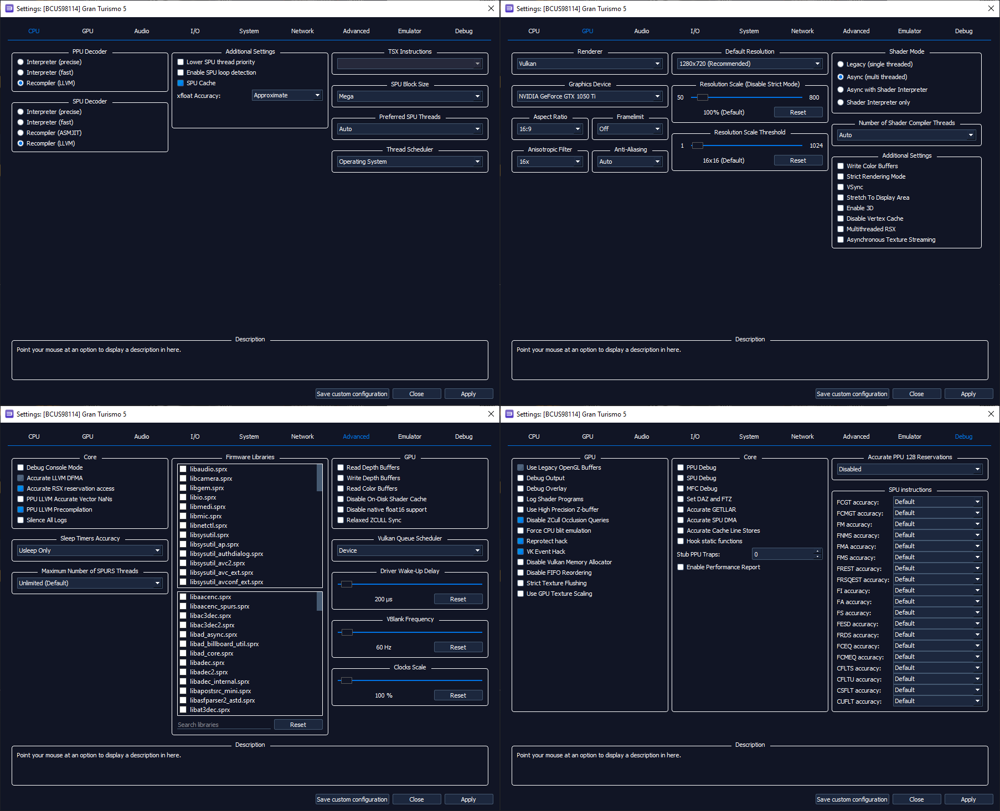

# Ideal RPCS3 Setup

## Quickstart Guide

The Quickstart guide has all the information you need to set up the emulator, and how to make a proper copy of your game that could be used with it.
Read it at [The Quickstart Guide](https://rpcs3.net/quickstart)

You can also join the [RPCS3 Discord](https://discord.com/invite/Af7H9yp)

---

## Recommended Settings

!!! success "Update"

    As of *02/06/2023*, desyncs have been fixed, no special build is required! Ignore `Reprotect Hack` and `VK Event Hack` in the Debug Settings.

To enable debug settings,

1. Navigate to:
    * `RPCS3\GuiConfigs` on Windows
    * `~/.config/rpcs3/GuiConfigs` on Linux
    * `~/Library/Application Support/rpcs3/GuiConfigs` on MacOS

2. Open `CurrentSettings.ini` with a text editor.
3. Change `showDebugTab=false` to `showDebugTab=true`.

!!! info "Game Specific Issues"

    For fixing, or checking issues, refer to the game specific pages on the RPCS3 Wiki:

    * [Gran Turismo 5](https://wiki.rpcs3.net/index.php?title=Gran_Turismo_5)
    * [Gran Turismo 6](https://wiki.rpcs3.net/index.php?title=Gran_Turismo_6)

---

## Develop/Debug Menu for GT6 1.02

GT6 1.02 mod since it runs better on that version - unlocks develop/debug menu (SELECT + R1)

[:octicons-download-16: Download](GT6_1.02_Develop.zip)

---

## RPCS3 Online LAN Tutorial.

!!! note
    Only RPCS3 <-> RPCS3 at the moment.

1. Set up GT5 on RPCS3 (make sure you have the latest RPCS3), Update the game to 2.11 by installing each update in order, and install Nenkai's LAN Mod.
2. Download RadminVPN and install it.
3. Connect to the Network `RPCS3 LAN`, Password is `Onlineplz`.
4. Copy the IP shown below your name in RadminVPN.
5. Open RPCS3s Config File for GT5, located in `/config/custom_configs/GT5s-GameID.yml`. If said file doesn't exist, right-click on GT5 and select `Create Custom Configuration`, then click save and check again.
6. Paste the IP you copied earlier in the IP Address field at the bottom.
7. Open RPCS3, and make sure you have Network Status set to Connected, and PSN Status set to Disconnected for GT5. (Right-click on GT5 and select `Create Custom Configuration`)
8. Run GT5, go to the Secret Settings at the very bottom of the Settings menu, and enable `label_lounge` under Display Options. Also enable Online Lounge Demo under `Special Network Options` to the right.
9. Go to the LAN Racing Symbol in the Main Menu, select `LAN Battle` and you should be good to go!

